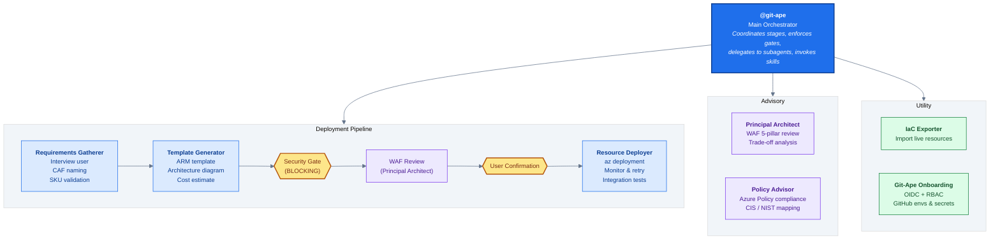
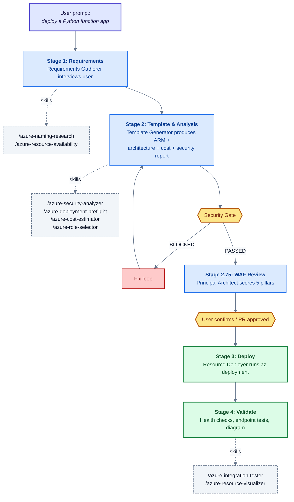
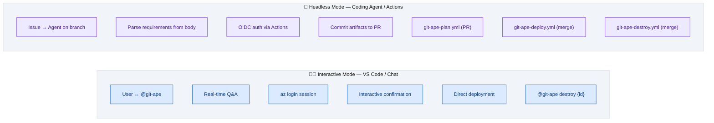

# Git-Ape

> [!WARNING]
> EXPERIMENTAL PROJECT: Git-Ape is in active development and is not production-ready.
> Use it for local development, demos, sandbox subscriptions, and learning only.

**📖 Documentation:** [azure.github.io/git-ape](https://azure.github.io/git-ape/) &nbsp;•&nbsp; **🛒 VS Code Marketplace:** [Git-ApeTeam.git-ape](https://marketplace.visualstudio.com/items?itemName=Git-ApeTeam.git-ape)

Git-Ape is a **platform engineering framework** built on GitHub Copilot. It is a multi-agent system that plans, validates, and deploys **any Azure workload** — with security gates, cost analysis, and CI/CD pipeline integration built in.

Nothing is deployed without your explicit confirmation.

## What Git-Ape Does

Git-Ape walks every deployment through the same four steps:

1. **Gather** requirements through a guided interview.
2. **Generate** an ARM template, architecture diagram, cost estimate, and security report.
3. **Confirm** with you (interactive) or via PR review (headless) before anything is created.
4. **Deploy** to Azure and run post-deployment validation.

It is built for:

- Any Azure resource deployable via Azure Resource Manager.
- Repository onboarding: OIDC, RBAC, GitHub environments, and secrets.
- Auditable deployments: every run is saved under `.azure/deployments/`.
- Drift detection between live Azure state and stored deployment artifacts via the `/azure-drift-detector` skill.

## Git-Ape in action

A short demo video of the onboarding and deploy experience using Git-Ape.

[](https://www.youtube.com/watch?v=Td6rv_RGArQ)


## Get Started

### Prerequisites

- A Bash-compatible shell (use `git-bash` on Windows). Other shells are untested.
- Azure CLI (`az`), GitHub CLI (`gh`), `jq`, and `git` installed and authenticated.
- Run `/prereq-check` in Copilot Chat to verify everything is in place.

### 1. Install the plugin

Git-Ape ships as a [VS Code agent plugin](https://code.visualstudio.com/docs/copilot/customization/agent-plugins) and as a GitHub Copilot CLI plugin. Pick the path that matches how you use Copilot.

#### Option A: VS Code Marketplace (one-click)

The fastest way to install Git-Ape in VS Code. The published listing bundles all agents and skills as a VS Code extension.

[](https://marketplace.visualstudio.com/items?itemName=Git-ApeTeam.git-ape) [](https://azure.github.io/git-ape/install.html) [](https://azure.github.io/git-ape/install-insiders.html)

1. Open the [Git-Ape listing on the VS Code Marketplace](https://marketplace.visualstudio.com/items?itemName=Git-ApeTeam.git-ape) and click **Install**, or use one of the badges above to open VS Code directly.
2. Verify the agents and skills appear in Copilot Chat — type `@git-ape` or `/prereq-check`.

#### Option B: VS Code marketplaces setting (advanced)

Use this path if you want to pull the latest from GitHub on every update, or if you also want the [`ape-context`](https://github.com/suuus/ape-context) companion plugin from the same marketplace.

1. Add the marketplace in your VS Code `settings.json`:

   [](https://azure.github.io/git-ape/open-settings.html) [](https://azure.github.io/git-ape/open-settings-insiders.html)

   ```jsonc
   "chat.plugins.marketplaces": [
       "Azure/git-ape"
   ]
   ```

2. Open the Extensions view (`⇧⌘X` on macOS, `Ctrl+Shift+X` on Windows/Linux), search for `@agentPlugins`, find **git-ape**, and select **Install**.
3. Alternatively, open the Command Palette (`⇧⌘P` on macOS, `Ctrl+Shift+P` on Windows/Linux), run **Chat: Install Plugin From Source**, and enter `https://github.com/Azure/git-ape`.
4. Verify the agents and skills appear in Copilot Chat (for example, type `@git-ape` or `/prereq-check`).

#### Option C: Copilot CLI plugin

```bash
copilot plugin marketplace add Azure/git-ape
copilot plugin install git-ape@git-ape
copilot plugin list   # Should show: git-ape@git-ape
```

Within Copilot CLI:

```text
/plugin marketplace add https://github.com/Azure/git-ape
/plugin install git-ape@git-ape
/plugin list   # Should show: git-ape@git-ape
```

#### Option D: Local development install

Clone this repository and register the local checkout as a VS Code plugin in `settings.json`:

```jsonc
"chat.pluginLocations": {
    "/absolute/path/to/git-ape": true
}
```

Reload VS Code; the `@git-ape` agent and Git-Ape skills will appear in Copilot Chat.

### 2. Configure Azure access

1. Sign in with `az login`.
2. Configure the Azure MCP server in VS Code — see the [Azure Setup](https://azure.github.io/git-ape/docs/getting-started/azure-setup) guide.

### 3. Use the agents

In Copilot Chat, try one of:

- `@git-ape deploy a Python function app`
- `@git-ape deploy a web app with SQL database`
- `@Git-Ape Onboarding set up this repo for Azure deployments`

### 4. Tear down

When you're done, clean up with:

- `@git-ape destroy Python function app`

## Where To Go Next

- [Examples](https://azure.github.io/git-ape/docs/deployment/examples): End-to-end deployment walkthroughs.
- [Azure Setup](https://azure.github.io/git-ape/docs/getting-started/azure-setup): Azure MCP server configuration for VS Code.
- [State Management](https://azure.github.io/git-ape/docs/deployment/state): How deployment artifacts are stored and reused.
- [Onboarding](https://azure.github.io/git-ape/docs/getting-started/onboarding): Repository onboarding, OIDC, RBAC, and GitHub environment setup.
- [Codespaces](https://azure.github.io/git-ape/docs/getting-started/codespaces): GitHub Codespaces and dev container setup.

## Architecture

`@git-ape` is the central orchestrator. It coordinates a pipeline of specialized subagents, enforces security gates, invokes skills, and manages deployment state. It never deploys anything without explicit user confirmation.

### Agent & Skill Orchestration



### Skills

Skills are invoked by agents at specific stages. Each skill handles one focused task.

| Phase | Skill | Purpose |
|-------|-------|---------|
| **Pre-Deploy** | `/azure-rest-api-reference` | Look up ARM property schemas and API versions. **Mandatory before any template generation.** |
| | `/azure-naming-research` | CAF abbreviation lookup, naming constraint validation |
| | `/azure-resource-availability` | SKU restrictions, version support, API compatibility, quota |
| | `/azure-security-analyzer` | Per-resource security assessment with blocking gate |
| | `/azure-policy-advisor` | Azure Policy compliance recommendations against CIS, NIST, or general best-practice frameworks |
| | `/azure-deployment-preflight` | What-if analysis and permission checks before deploy |
| | `/azure-role-selector` | Least-privilege RBAC role recommendations |
| | `/azure-cost-estimator` | Real-time cost estimation via Azure Retail Prices API |
| | `/prereq-check` | Verify required CLI tools and auth sessions are ready |
| **Post-Deploy** | `/azure-integration-tester` | Post-deployment health checks and endpoint tests |
| | `/azure-resource-visualizer` | Generate Mermaid diagrams from live Azure resources |
| **Operations** | `/azure-drift-detector` | Detect config drift between live Azure and stored state |
| | `/git-ape-onboarding` | Guided setup for OIDC, RBAC, environments, and secrets |

### Deployment Flow



### Execution Modes

Git-Ape runs the same agents and skills in two different contexts.



**Interactive** — you talk to `@git-ape` in VS Code Copilot Chat, authenticate via `az login`, and approve each step in real time.

**Headless** — the Copilot Coding Agent picks up a GitHub issue, generates the template on a branch, opens a PR, and the CI/CD workflows (`git-ape-plan`, `git-ape-deploy`, `git-ape-destroy`) handle validation, deployment, and teardown via OIDC.

### CI/CD Workflows

| Workflow | Trigger | Purpose |
|----------|---------|---------|
| `git-ape-plan.yml` | PR with template changes | Validate, what-if, post plan as PR comment |
| `git-ape-deploy.yml` | Merge to main or `/deploy` comment | Execute ARM deployment |
| `git-ape-destroy.yml` | Merge PR with `destroy-requested` | Delete resource group |
| `git-ape-verify.yml` | Manual dispatch | Verify OIDC, RBAC, pipeline health |

> **Note:** These workflows ship as `git-ape-*.exampleyml` files in `.github/workflows/` and are inert until the `/git-ape-onboarding` flow renames them to `.yml` after you complete the experimental-status acknowledgments.

## Included Components

Git-Ape is packaged as a Copilot CLI plugin with agents and skills under `.github/`:

```
plugin.json                          # Plugin manifest
.github/
├── agents/
│   ├── git-ape.agent.md                       # Main orchestrator
│   ├── git-ape-onboarding.agent.md            # Onboarding agent
│   ├── azure-requirements-gatherer.agent.md
│   ├── azure-template-generator.agent.md
│   ├── azure-resource-deployer.agent.md
│   ├── azure-principal-architect.agent.md
│   ├── azure-policy-advisor.agent.md
│   └── azure-iac-exporter.agent.md
├── skills/
│   ├── git-ape-onboarding/          # OIDC, RBAC, env setup
│   ├── azure-rest-api-reference/    # ARM property + API version lookup
│   ├── azure-naming-research/       # CAF naming
│   ├── azure-resource-availability/ # SKU & quota checks
│   ├── azure-security-analyzer/     # Security assessment
│   ├── azure-policy-advisor/        # Azure Policy compliance
│   ├── azure-deployment-preflight/  # What-if analysis
│   ├── azure-role-selector/         # RBAC recommendations
│   ├── azure-cost-estimator/        # Cost estimation
│   ├── azure-drift-detector/        # Drift detection
│   ├── azure-integration-tester/    # Post-deploy tests
│   ├── azure-resource-visualizer/   # Architecture diagrams
│   └── prereq-check/                # CLI tool + auth session verification
└── workflows/
    ├── git-ape-plan.exampleyml      # Activated to .yml by /git-ape-onboarding
    ├── git-ape-deploy.exampleyml
    ├── git-ape-destroy.exampleyml
    └── git-ape-verify.exampleyml
```

See [plugin.json](plugin.json) and [.github/plugin/marketplace.json](.github/plugin/marketplace.json) for packaging details.

## License

MIT License. See [LICENSE](LICENSE).
