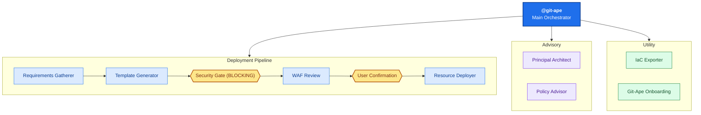

<!-- AUTO-GENERATED — DO NOT EDIT. Source: .github/agents/ -->

# Agents Overview

Git-Ape uses a multi-agent architecture where `@git-ape` is the central orchestrator that delegates to specialized sub-agents.

## Agent Inventory

| Agent | Description | User Invocable |
|-------|-------------|:--------------:|
| [Azure IaC Exporter](./azure-iac-exporter) | Export existing Azure resources to ARM templates by analyzing live Azure state. Reverse-engineers deployed resources into IaC templates compatible with Git-Ape. Use when importing existing resources into Git-Ape management. | ✅ |
| [Azure Policy Advisor](./azure-policy-advisor) | Assess Azure Policy compliance for ARM template resources. Queries existing subscription assignments and unassigned custom/built-in definitions, cross-references with Microsoft Learn recommendations. Produces split report: Part 1 (template improvements) and Part 2 (subscription-level policy assignments). | ✅ |
| [Azure Principal Architect](./azure-principal-architect) | Provide expert Azure architecture guidance using the Well-Architected Framework (WAF) 5 pillars. Evaluate deployments against Security, Reliability, Performance, Cost, and Operational Excellence. Use for architecture reviews, trade-off analysis, and design validation. | ✅ |
| [Azure Requirements Gatherer](./azure-requirements-gatherer) | Gather Azure deployment requirements through guided questions. Validate subscription access, check resource naming conflicts, query existing resources. Use when starting any Azure deployment workflow. | ❌ |
| [Azure Resource Deployer](./azure-resource-deployer) | Execute ARM template deployments to Azure. Monitor deployment progress, handle failures with rollback options, verify resource creation. Use only after user has confirmed deployment intent. | ❌ |
| [Azure Template Generator](./azure-template-generator) | Generate ARM templates from requirements. Apply Azure best practices, validate schema, show what-if analysis. Echo deployment intent for user confirmation. Use after requirements gathering is complete. | ❌ |
| [Git-Ape Onboarding](./git-ape-onboarding) | Onboard a new repository, subscription(s), and user access for Git-Ape using the git-ape-onboarding skill playbook. Configures OIDC, RBAC, GitHub environments, and secrets. | ✅ |
| [Git-Ape](./git-ape) | Deploy Azure resources through guided workflow: gather requirements, generate ARM templates, verify intent, execute deployment, run integration tests. Use for Azure Functions, App Services, Storage, Databases, Container Apps. | ✅ |

## Orchestration Architecture

