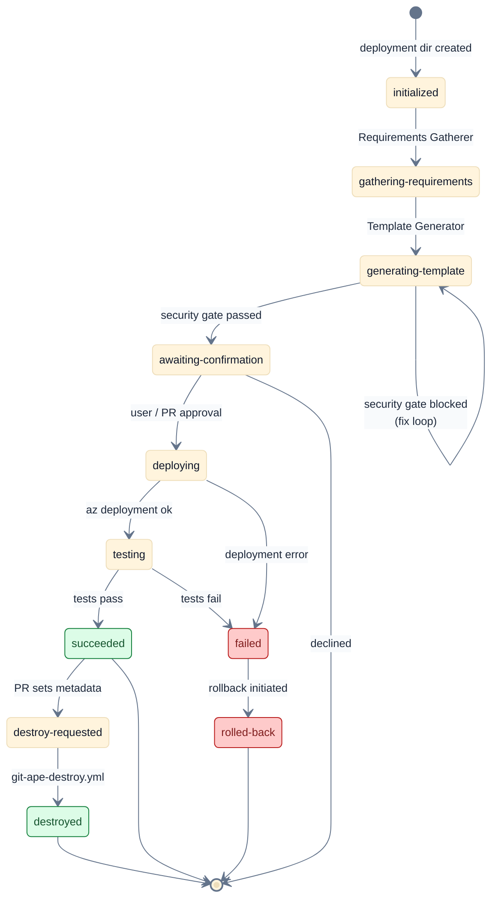
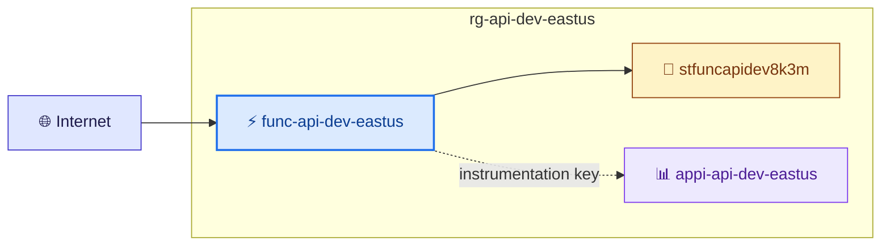

# Deployment State Management

:::warning
EXPERIMENTAL ONLY: State formats, file schemas, and lifecycle behavior may change at any time.
Do **not** rely on this project for production deployment tracking, audit, or recovery.
:::
This document explains how Git-Ape persists deployment artifacts, manages state, and enables deployment reuse.

## Overview

Every deployment creates a subdirectory under `.azure/deployments/{deployment-id}/`.

Each deployment directory contains:

- Complete audit trail of the deployment process
- Reusable configuration for future deployments
- Test results and logs for debugging
- Error information for failure analysis

## Deployment Lifecycle

A deployment moves through a defined set of states tracked in `metadata.json`. Valid `status` values are `initialized`, `gathering-requirements`, `generating-template`, `awaiting-confirmation`, `deploying`, `testing`, `succeeded`, `failed`, `rolled-back`, `destroy-requested`, and `destroyed`. Terminal states (`succeeded`, `failed`, `rolled-back`, `destroyed`) are persisted in git for audit.



## Directory Structure

### Azure

```
.azure/deployments/
├── deploy-20260218-143022/           # Successful deployment
│   ├── metadata.json                  # Deployment metadata
│   ├── requirements.json              # User requirements
│   ├── template.json                  # ARM template
│   ├── parameters.json                # Template parameters
│   ├── architecture.md                # Mermaid architecture diagram
│   ├── deployment.log                 # Deployment progress
│   └── tests.json                     # Test results
│
├── deploy-20260218-151030/           # Failed deployment
│   ├── metadata.json
│   ├── requirements.json
│   ├── template.json
│   ├── architecture.md
│   ├── deployment.log
│   └── error.log                      # Error details
│
└── deploy-20260218-163500/           # Rolled back deployment
    ├── metadata.json
    ├── requirements.json
    ├── template.json
    ├── architecture.md
    ├── deployment.log
    └── rollback.log                   # Rollback actions
```


## File Formats

### metadata.json

Contains deployment tracking information.

**Example:**

```json
{
  "deploymentId": "deploy-20260218-143022",
  "timestamp": "2026-02-18T14:30:22Z",
  "user": "arnaud@example.com",
  "status": "succeeded",
  "scope": "subscription",
  "region": "eastus",
  "project": "api",
  "environment": "dev",
  "resourceGroup": "rg-api-dev-eastus",
  "resources": [
    {
      "type": "Microsoft.Web/sites",
      "name": "func-api-dev-eastus",
      "id": "/subscriptions/.../resourceGroups/rg-api-dev-eastus/providers/Microsoft.Web/sites/func-api-dev-eastus",
      "status": "succeeded"
    }
  ],
  "estimatedMonthlyCost": "$12.50",
  "createdBy": "git-ape-agent"
}
```

**Status values:**
- `initialized` - Deployment directory created
- `gathering-requirements` - Collecting user input
- `generating-template` - Creating ARM template
- `awaiting-confirmation` - Waiting for user approval
- `deploying` - Deployment in progress
- `testing` - Running integration tests
- `succeeded` - Completed successfully
- `failed` - Deployment failed
- `rolled-back` - Resources removed after failure
- `destroyed` - Resources torn down
- `already-destroyed` - Resources were already deleted
- `destroy-requested` - Teardown has been requested

### requirements.json

User requirements collected by the Requirements Gatherer agent:

```json
{
  "deploymentId": "deploy-20260218-143022",
  "timestamp": "2026-02-18T14:30:22Z",
  "user": "arnaud@example.com",
  "type": "multi-resource",
  "resources": [
    {
      "type": "Microsoft.Web/sites",
      "kind": "functionapp",
      "name": "func-api-dev-eastus",
      "region": "eastus",
      "resourceGroup": "rg-api-dev-eastus",
      "sku": "Y1",
      "runtime": "python",
      "runtimeVersion": "3.11",
      "configuration": {
        "httpsOnly": true,
        "alwaysOn": false,
        "appInsights": true
      }
    },
    {
      "type": "Microsoft.Storage/storageAccounts",
      "name": "stfuncdeveastus8k3m",
      "region": "eastus",
      "resourceGroup": "rg-api-dev-eastus",
      "sku": "Standard_LRS",
      "kind": "StorageV2"
    }
  ],
  "dependencies": [
    {
      "source": "stfuncdeveastus8k3m",
      "target": "func-api-dev-eastus",
      "type": "storage-connection"
    }
  ],
  "validation": {
    "subscriptionAccess": true,
    "resourceGroupExists": false,
    "namesAvailable": true,
    "regionSupported": true,
    "quotaAvailable": true
  },
  "estimatedCost": 12.50
}
```

### template.json / template.yaml

**Azure** uses `template.json` — a standard ARM template:

```json
{
  "$schema": "https://schema.management.azure.com/schemas/2019-04-01/deploymentTemplate.json#",
  "contentVersion": "1.0.0.0",
  "parameters": {
    "functionAppName": {
      "type": "string",
      "defaultValue": "func-api-dev-eastus"
    },
    "location": {
      "type": "string",
      "defaultValue": "eastus"
    }
  },
  "variables": {
    "storageAccountName": "stfuncdeveastus8k3m"
  },
  "resources": [
    {
      "type": "Microsoft.Storage/storageAccounts",
      "apiVersion": "2021-04-01",
      "name": "[variables('storageAccountName')]",
      "location": "[parameters('location')]",
      "sku": {
        "name": "Standard_LRS"
      },
      "kind": "StorageV2"
    },
    {
      "type": "Microsoft.Web/sites",
      "apiVersion": "2021-02-01",
      "name": "[parameters('functionAppName')]",
      "location": "[parameters('location')]",
      "kind": "functionapp",
      "dependsOn": [
        "[resourceId('Microsoft.Storage/storageAccounts', variables('storageAccountName'))]"
      ],
      "properties": {
        "httpsOnly": true,
        "siteConfig": {
          "appSettings": [
            {
              "name": "AzureWebJobsStorage",
              "value": "[concat('DefaultEndpointsProtocol=https;AccountName=', variables('storageAccountName'), ';AccountKey=', listKeys(resourceId('Microsoft.Storage/storageAccounts', variables('storageAccountName')), '2021-04-01').keys[0].value)]"
            }
          ]
        }
      }
    }
  ],
  "outputs": {
    "functionAppUrl": {
      "type": "string",
      "value": "[concat('https://', reference(parameters('functionAppName')).defaultHostName)]"
    }
  }
}
```

### deployment.log

Human-readable deployment progress log:

```
[2026-02-18T14:30:22Z] Deployment initialized: deploy-20260218-143022
[2026-02-18T14:30:22Z] User: arnaud@example.com
[2026-02-18T14:30:22Z] Target: Resource Group 'rg-api-dev-eastus' (East US)

[2026-02-18T14:31:45Z] Stage 1: Requirements Gathering
[2026-02-18T14:31:45Z] ✓ Subscription access verified
[2026-02-18T14:31:46Z] ✓ Resource naming validated
[2026-02-18T14:31:47Z] ✓ Requirements document saved

[2026-02-18T14:32:10Z] Stage 2: Template Generation
[2026-02-18T14:32:11Z] ✓ ARM template generated
[2026-02-18T14:32:12Z] ✓ Schema validation passed
[2026-02-18T14:32:13Z] ✓ Best practices applied

[2026-02-18T14:33:00Z] Stage 3: User Confirmation
[2026-02-18T14:33:00Z] Awaiting user approval...
[2026-02-18T14:33:45Z] ✓ User confirmed deployment

[2026-02-18T14:33:46Z] Stage 4: Deployment Execution
[2026-02-18T14:33:46Z] Creating resource group: rg-api-dev-eastus
[2026-02-18T14:33:50Z] ✓ Resource group created
[2026-02-18T14:33:51Z] Deploying ARM template...
[2026-02-18T14:34:05Z] ⧗ Deployment in progress (15s)
[2026-02-18T14:34:20Z] ⧗ Deployment in progress (30s)
[2026-02-18T14:37:22Z] ✓ Deployment succeeded (3m36s)

[2026-02-18T14:37:23Z] Stage 5: Integration Testing
[2026-02-18T14:37:30Z] ✓ Function App accessible
[2026-02-18T14:37:31Z] ✓ HTTPS enforced
[2026-02-18T14:37:32Z] ✓ Application Insights connected

[2026-02-18T14:37:33Z] Deployment completed successfully
[2026-02-18T14:37:33Z] Total duration: 7m11s
```

### tests.json

Integration test results:

```json
{
  "deploymentId": "deploy-20260218-143022",
  "timestamp": "2026-02-18T14:37:33Z",
  "resourceType": "Microsoft.Web/sites",
  "resourceName": "func-api-dev-eastus",
  "tests": [
    {
      "name": "HTTPS Endpoint Accessibility",
      "category": "connectivity",
      "status": "passed",
      "duration": 245,
      "details": "Response: 200 OK in 245ms"
    },
    {
      "name": "Response Time",
      "category": "performance",
      "status": "passed",
      "threshold": 3000,
      "actual": 245,
      "details": "Well within threshold"
    },
    {
      "name": "HTTPS Enforcement",
      "category": "security",
      "status": "passed",
      "details": "HTTP redirects to HTTPS"
    },
    {
      "name": "Application Insights",
      "category": "monitoring",
      "status": "passed",
      "details": "Instrumentation key configured"
    }
  ],
  "summary": {
    "total": 4,
    "passed": 4,
    "failed": 0,
    "warnings": 0
  },
  "overallStatus": "healthy"
}
```

### architecture.md

Mermaid architecture diagram generated during template creation. Shown to user during confirmation and saved for reference:

````markdown
# Architecture Diagram



## Resource Inventory

| Resource | Type | Name | Region | CAF |
|----------|------|------|--------|-----|
| Function App | Microsoft.Web/sites | func-api-dev-eastus | East US | ✓ func |
| Storage Account | Microsoft.Storage/storageAccounts | stfuncapidev8k3m | East US | ✓ st |
| Application Insights | Microsoft.Insights/components | appi-api-dev-eastus | East US | ✓ appi |
````

### error.log

Error details for failed deployments:

```
[2026-02-18T14:35:15Z] ERROR: Deployment Failed
[2026-02-18T14:35:15Z] Resource: Microsoft.Web/sites/func-api-dev-eastus
[2026-02-18T14:35:15Z] Error Code: QuotaExceeded
[2026-02-18T14:35:15Z] Message: The subscription has reached its quota limit for Function Apps in East US region

Possible Causes:
1. Subscription quota limit reached (check: az vm list-usage --location eastus)
2. Region capacity constraints
3. Trial/free tier limitations

Recommended Actions:
A. Request quota increase via Azure Portal
B. Try different region (e.g., West US 2)
C. Delete unused Function Apps to free quota
D. Upgrade subscription tier

Stack Trace:
 at Microsoft.Azure.Management.WebSites.SitesOperationsExtensions.CreateOrUpdate
 at Git-Ape.ResourceDeployer.DeployResource
 at Git-Ape.Orchestrator.ExecuteDeployment

Related Documentation:
- https://learn.microsoft.com/azure/azure-resource-manager/management/request-limits-and-throttling
- https://learn.microsoft.com/azure/azure-functions/functions-scale
```

## Using the Deployment Manager

The `.github/scripts/deployment-manager.sh` utility helps manage deployment state:

### List All Deployments

```bash
.github/scripts/deployment-manager.sh list
```

Output:
```
Recent Deployments
-----------------------------------------------------------

☁ Azure (.azure/deployments/)
-----------------------------------------------------------
✓ deploy-20260218-163500
  Status: succeeded | Project: api | Region: eastus
  Resources: 3 | Cost: $12.50 | Time: 2026-02-18T16:35:00Z

↶ deploy-20260218-151030
  Status: rolled-back | Project: webapp | Region: westus2
  Resources: 1 | Cost: N/A | Time: 2026-02-18T15:10:30Z
```

### Initialize a Deployment

```bash
.github/scripts/deployment-manager.sh init my-app-dev
```

### Show Deployment Details

```bash
.github/scripts/deployment-manager.sh show deploy-20260218-163500
```

### Export as Reusable Template

```bash
.github/scripts/deployment-manager.sh export deploy-20260218-163500 templates/my-function-app.json
```

Creates:
- `templates/my-function-app.json` - ARM template
- `templates/my-function-app.parameters.json` - Parameters file

### Clean Up Old Deployments

```bash
# Keep 10 most recent deployments, delete older ones
.github/scripts/deployment-manager.sh clean 10
```

### Validate Deployment State

```bash
.github/scripts/deployment-manager.sh validate deploy-20260218-143022
```

Checks:
- ✓ metadata.json exists and is valid JSON
- ✓ requirements.json exists and is valid JSON
- ✓ template.json exists and is valid JSON
- ⚠ deployment.log present (optional)
- ⚠ tests.json present (optional)

## Reusing Deployments

### Simple Reuse

```
User: @git-ape deploy the same Function App as last time

Agent: Found previous deployment: deploy-20260218-163500

Resources from previous deployment:
- Python Function App (3.11, Consumption)
- Storage Account (Standard_LRS)
- Application Insights

Would you like to:
A. Use the same configuration (I'll update names/timestamps)
B. Modify the configuration before deployment
C. Choose a different previous deployment

User: A

Agent: I'll update the names and deploy:
- func-api-dev-eastus → func-api-dev-eastus2
- stfuncdeveastus8k3m → stfuncdeveastus9p7r

Proceed?
```

### Selective Reuse

```
User: @git-ape use the storage configuration from deploy-20260218-143022 but for a different region

Agent: Loading storage configuration from deploy-20260218-143022...

Previous config:
- Storage Account: Standard_LRS
- Region: East US
- Kind: StorageV2
- HTTPS only: true

What region would you like?

User: West Europe

Agent: I'll create:
- Storage Account: stfuncdevwesteurope4k2m
- Region: West Europe
- Same SKU and configuration as previous deployment

Proceed?
```

## Best Practices

### Audit Trail

Keep deployment state as an audit trail:

```bash
# Never delete .azure/deployments/ directory
# Add to .gitignore if contains sensitive data
echo ".azure/deployments/" >> .gitignore

# Or commit for team visibility (remove sensitive values first)
git add .azure/deployments/*/metadata.json
git add .azure/deployments/*/requirements.json
git commit -m "Record deployment metadata"
```

### Cost Tracking

Use deployment state to track costs over time:

```bash
# Extract estimated costs from all deployments
jq -r '.estimatedCost' .azure/deployments/*/metadata.json | awk '{sum+=$1} END {print "Total estimated monthly cost: $" sum}'
```

### Disaster Recovery

Export critical deployments as templates:

```bash
# Export production deployments
for deploy in $(ls -d .azure/deployments/deploy-*-prod-*); do
  .github/scripts/deployment-manager.sh export $(basename "$deploy") "backups/$(basename "$deploy").json"
done
```

### Documentation

Link deployment IDs in documentation:

```markdown
## Production Environment

Current deployment: `deploy-20260218-163500`

Resources:
- Function App: func-api-prod-eastus
- Storage: stfuncprodeastus8k3m
- App Insights: appi-api-prod-eastus

See `.azure/deployments/deploy-20260218-163500/` for full configuration.
```

## Troubleshooting

### Missing Deployment Files

If a deployment is missing files:

```bash
# Validate what's missing
.github/scripts/deployment-manager.sh validate deploy-20260218-143022

# Shows:
# ✗ Missing requirements.json
# ✓ metadata.json found
# ✗ template.json not found
```

**Cause:** Deployment was interrupted before saving all files.

**Solution:** Re-run the deployment or manually create missing files.

### Corrupted JSON Files

```bash
# Validate automatically detects corrupted JSON
.github/scripts/deployment-manager.sh validate deploy-20260218-143022

# Shows:
# ✓ metadata.json found
#   ✗ Invalid JSON format
```

**Cause:** File was truncated or manually edited incorrectly.

**Solution:**
```bash
# Check JSON syntax
jq '.' .azure/deployments/deploy-20260218-143022/metadata.json

# Fix manually or delete and re-run deployment
```

### Old Deployments Taking Space

```bash
# Check disk usage
du -sh .azure/deployments/*/

# Clean up (keep 5 most recent)
.github/scripts/deployment-manager.sh clean 5
```

## Related Documentation

- [Azure MCP Setup Guide](../getting-started/azure-setup)
- [Integration Testing Guide](../skills/azure-integration-tester)
- [ARM Template Best Practices](https://learn.microsoft.com/azure/azure-resource-manager/templates/best-practices)
