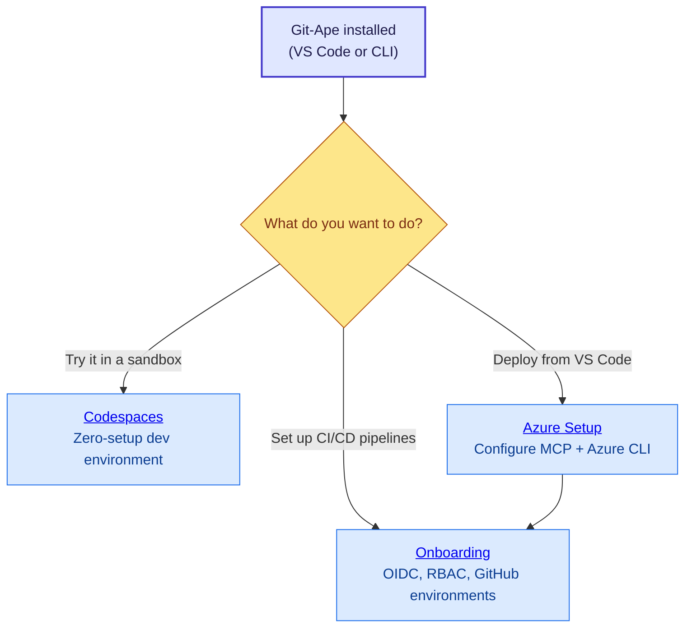

# Installation & Prerequisites

## Prerequisites

Before you start, make sure you have:

- **A Bash-compatible shell** — macOS and Linux work out of the box. On Windows, install [Git for Windows](https://gitforwindows.org/) and use Git Bash.
- **Azure CLI, GitHub CLI, jq, and git** — installed and authenticated.

:::tip[Quick check]
Run `/prereq-check` in Copilot Chat after installation. It validates every tool and auth session for you and shows platform-specific install commands for anything missing.
:::

## Which installation method should I use?

| Method | Best for | Requirements |
|--------|----------|--------------|
| **VS Code plugin** | Day-to-day Azure deployments from your editor | VS Code + Copilot + `chat.plugins.enabled` |
| **Copilot CLI plugin** | Terminal-first workflows or CI scripting | Copilot CLI |
| **Local dev install** | Contributing to Git-Ape itself | Git clone of the repo |
| **GitHub Codespaces** | Trying Git-Ape without any local setup | GitHub account |

Most users should start with the **VS Code plugin**. If you just want to try Git-Ape without installing anything, jump to [Codespaces](./codespaces).

## Option A: VS Code agent plugin (recommended) {#vscode-plugin}

Your organization must have the `chat.plugins.enabled` setting set to `true`. If you are unsure, ask your admin or try the steps below — VS Code will tell you if plugins are disabled.

1. Add the Git-Ape marketplace to your VS Code `settings.json`:

   [](pathname:///open-settings.html) [](pathname:///open-settings-insiders.html)

   ```jsonc
   "chat.plugins.marketplaces": [
       "Azure/git-ape"
   ]
   ```

2. Open the Extensions view (`⇧⌘X` on macOS, `Ctrl+Shift+X` on Windows/Linux), search for `@agentPlugins`, find **git-ape**, and select **Install**.

   Alternatively, open the Command Palette (`⇧⌘P` / `Ctrl+Shift+P`), run **Chat: Install Plugin From Source**, and enter `https://github.com/Azure/git-ape`.

3. Verify the agents and skills appear in Copilot Chat — type `@git-ape` or `/prereq-check`.

## Option B: Copilot CLI plugin {#cli-plugin}

```bash
copilot plugin marketplace add Azure/git-ape
copilot plugin install git-ape@git-ape
copilot plugin list   # Should show: git-ape@git-ape
```

## Option C: Local development install {#local-dev}

Use this if you are contributing to Git-Ape or want to test local changes.

```bash
git clone https://github.com/Azure/git-ape.git
```

Register the local checkout in your VS Code `settings.json`:

```jsonc
"chat.pluginLocations": {
    "/absolute/path/to/git-ape": true
}
```

Reload VS Code; the `@git-ape` agent and skills will appear in Copilot Chat.

## Verify installation

In Copilot Chat, type:

```text
@git-ape hello
```

You should see the Git-Ape orchestrator respond. If it does not, reload the VS Code window (`Cmd+Shift+P` → **Developer: Reload Window**).

## What's next?

You have Git-Ape installed. Here is the recommended path depending on what you want to do:

- [VS Code vs Copilot CLI](./vscode-vs-cli) — feature parity and when to pick which surface



- **[Azure Setup](./azure-setup)** — Connect Git-Ape to your Azure subscription so it can deploy resources.
- **[Onboarding](./onboarding)** — Configure OIDC, RBAC, and GitHub environments for CI/CD pipelines.
- **[Codespaces](./codespaces)** — Spin up a ready-to-use dev environment in your browser.
