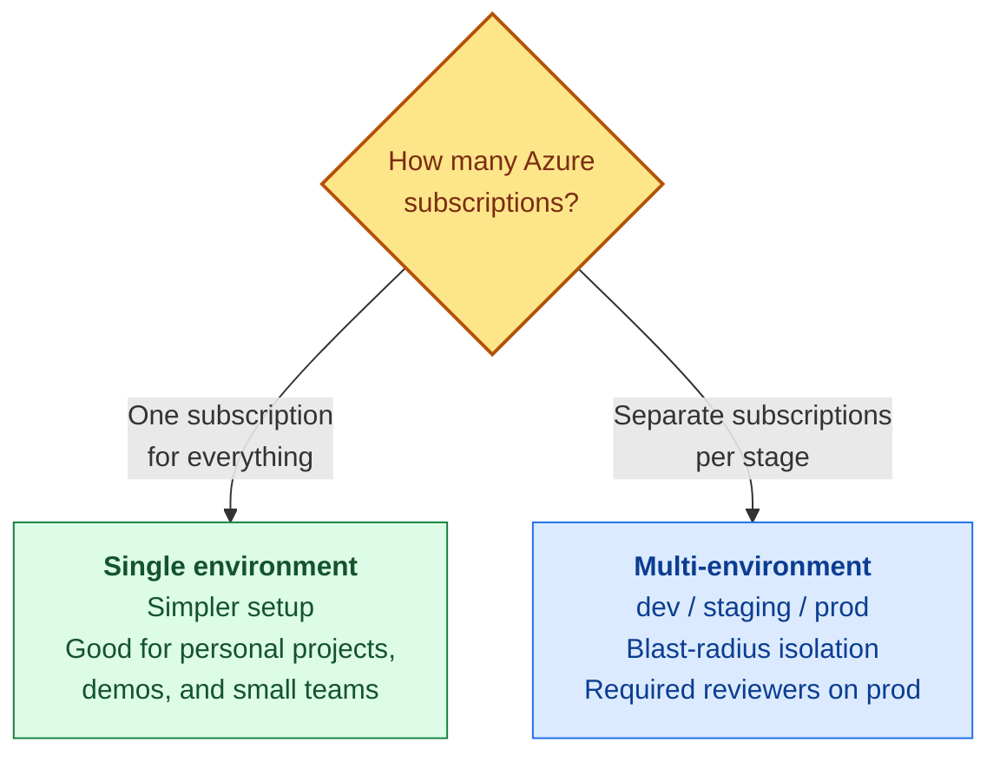
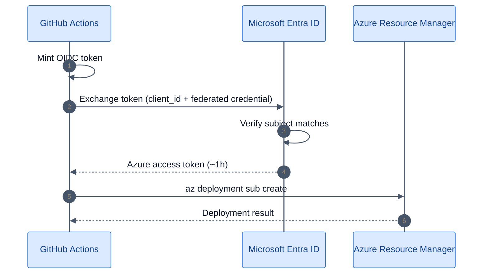

# Repository onboarding

This page helps you connect a GitHub repository to Azure so that Git-Ape's CI/CD workflows can deploy resources automatically. By the end you will have OIDC federation, RBAC roles, and GitHub environments configured.

:::warning
EXPERIMENTAL ONLY — This onboarding flow is for testing and evaluation. Do **not** use Git-Ape in production environments. Validate all generated configuration manually before any real deployment.
:::

## Choose your onboarding path

Git-Ape can automate the entire setup for you, or you can run each step manually.

| Path | When to choose it |
|------|-------------------|
| **[Automated](#automated-onboarding)** | You want the fastest path. Copilot Chat runs every command for you. |
| **[Manual](#manual-setup)** | You want to understand each component, or your organization requires manual approval of identity and RBAC changes. |

Both paths produce the same result: an Entra ID App Registration with OIDC federated credentials, RBAC role assignments, and GitHub environments with the required secrets.

## Choose single or multi-environment mode {#choose-mode}

Before onboarding, decide how many Azure subscriptions you need.



| | Single environment | Multi-environment |
|---|---|---|
| **GitHub environments** | `azure-deploy`, `azure-destroy` | `azure-deploy-dev`, `azure-deploy-staging`, `azure-deploy-prod`, `azure-destroy` |
| **Secrets scope** | Repository-level | Environment-level per stage |
| **Subscriptions** | One | One per stage |
| **Federated credentials** | 4 | 4 + one per extra stage |
| **Best for** | Personal projects, demos, PoCs | Teams, staging gates, production isolation |

:::tip[Not sure?]
Start with **single environment**. You can switch to multi-environment later by adding more federated credentials and GitHub environments.
:::

## How OIDC authentication works

Git-Ape uses OpenID Connect (OIDC) so that **no client secrets are stored** in your repository. GitHub mints a short-lived token at workflow runtime, Entra ID verifies it against a trust relationship you configure once, and returns an Azure access token.



The trust chain you create during onboarding:

```mermaid
%%{init: {'theme':'base','themeVariables':{'fontSize':'13px','lineColor':'#64748b','textColor':'#1e293b','primaryTextColor':'#0f172a','edgeLabelBackground':'#f8fafc','tertiaryColor':'#f1f5f9'}}}%%
graph LR
    GH["GitHub Repo"] -->|trusts| FC["Federated Credential"]
    FC -->|attached to| APP["Entra App Registration"]
    APP -->|backed by| SP["Service Principal"]
    SP -->|assigned| ROLE["RBAC Role"]
    ROLE -->|scoped to| SUB["Azure Subscription"]

    classDef gh fill:#dbeafe,stroke:#1f6feb,stroke-width:1px,color:#0b3d91
    classDef entra fill:#ede9fe,stroke:#7c3aed,stroke-width:1px,color:#4c1d95
    classDef azure fill:#dcfce7,stroke:#15803d,stroke-width:1px,color:#14532d

    class GH,FC gh
    class APP,SP entra
    class SUB,ROLE azure
```



---

## Automated onboarding

Run one of these commands in Copilot Chat:

```text
@Git-Ape Onboarding onboard this repository
```

or:

```text
/git-ape-onboarding
```

The skill collects five inputs (or uses sensible defaults):

1. **GitHub repository URL** — for example, `https://github.com/your-org/your-repo`
2. **Entra ID App Registration name** — for example, `sp-git-ape-your-repo`
3. **Mode** — single or multi-environment
4. **Azure subscription(s)** — defaults to your current `az` subscription
5. **RBAC role(s)** — Contributor (default) or Contributor + User Access Administrator

### Example: single environment

```text
/git-ape-onboarding onboard https://github.com/your-org/your-repo on subscription 00000000-... with Contributor
```

### Example: multi-environment

```text
/git-ape-onboarding onboard https://github.com/your-org/your-repo with dev on 11111111-... as Contributor, staging on 22222222-... as Contributor, prod on 33333333-... as Contributor+UserAccessAdministrator
```

After the skill finishes, skip to [Verify your setup](#verify-setup).

---

## Manual setup

Follow these steps if you want to run each command yourself or need to understand what the automated flow does.

### Prerequisites

| Tool | Minimum version | Purpose |
|------|-----------------|---------|
| Azure CLI (`az`) | 2.50+ | Entra ID, RBAC, OIDC |
| GitHub CLI (`gh`) | 2.0+ | Secrets, environments |
| jq | 1.6+ | JSON parsing |

:::tip
Run `/prereq-check` in Copilot Chat to validate tools and auth sessions automatically.
:::

:::info[VS Code agent plugin requirement]
Git-Ape is available both as a regular [VS Code extension](https://marketplace.visualstudio.com/items?itemName=Git-ApeTeam.git-ape) and as a [VS Code agent plugin](https://code.visualstudio.com/docs/copilot/customization/agent-plugins) (and as a Copilot CLI plugin). The **agent-plugin** install path is gated by the **`chat.plugins.enabled`** setting, which is **managed at the organization level**. If contributors used the agent-plugin path (`chat.plugins.marketplaces` / `copilot plugin install`) and `@git-ape` does not appear in Copilot Chat, either ask your GitHub Copilot administrator to enable agent plugins, or have contributors install from the [VS Code Marketplace](https://marketplace.visualstudio.com/items?itemName=Git-ApeTeam.git-ape) instead — that path is not affected by the setting. The Copilot CLI surface is also not affected.
:::

<details>
<summary><strong>Install commands by platform</strong></summary>

**macOS:**
```bash
brew install azure-cli gh jq
```

**Ubuntu / Debian:**
```bash
curl -sL https://aka.ms/InstallAzureCLIDeb | sudo bash
# GitHub CLI — see https://github.com/cli/cli/blob/trunk/docs/install_linux.md
sudo apt-get install -y jq
```

**Windows (PowerShell):**
```powershell
winget install Microsoft.AzureCLI
winget install GitHub.cli
winget install jqlang.jq
```

</details>

Sign in to both:

```bash
az login           # needs Owner or User Access Administrator on the subscription
gh auth login      # needs admin access to the target repository
```

### Step 1: Create an Entra ID App Registration

This creates the identity that GitHub Actions will use.

```bash
SP_NAME="sp-git-ape-your-repo"

CLIENT_ID=$(az ad app create --display-name "$SP_NAME" --query appId -o tsv)
echo "Client ID: $CLIENT_ID"

az ad sp create --id "$CLIENT_ID"

TENANT_ID=$(az account show --query tenantId -o tsv)
echo "Tenant ID: $TENANT_ID"
```

### Step 2: Add OIDC federated credentials

These tell Entra ID which GitHub tokens to trust.

```bash
OBJECT_ID=$(az ad app show --id "$CLIENT_ID" --query id -o tsv)
REPO="your-org/your-repo"

# Detect customized OIDC subjects (some orgs override the default format)
USE_DEFAULT=$(gh api "orgs/${REPO%%/*}/actions/oidc/customization/sub" --jq '.use_default' 2>/dev/null || echo true)

if [[ "$USE_DEFAULT" == "false" ]]; then
  REPO_ID=$(gh api "repos/$REPO" --jq '.id')
  OWNER_ID=$(gh api "repos/$REPO" --jq '.owner.id')
  OIDC_PREFIX="repository_owner_id:${OWNER_ID}:repository_id:${REPO_ID}"
else
  OIDC_PREFIX="repo:$REPO"
fi
```

Create the credentials. You need **at least four** — main branch, pull requests, deploy environment, and destroy environment:

```bash
# Main branch (merge-triggered deployments)
az ad app federated-credential create --id "$OBJECT_ID" --parameters '{
  "name": "fc-main-branch",
  "issuer": "https://token.actions.githubusercontent.com",
  "subject": "'"$OIDC_PREFIX"':ref:refs/heads/main",
  "audiences": ["api://AzureADTokenExchange"]
}'

# Pull requests (plan validation)
az ad app federated-credential create --id "$OBJECT_ID" --parameters '{
  "name": "fc-pull-request",
  "issuer": "https://token.actions.githubusercontent.com",
  "subject": "'"$OIDC_PREFIX"':pull_request",
  "audiences": ["api://AzureADTokenExchange"]
}'
```

<details>
<summary><strong>Single environment: deploy + destroy credentials</strong></summary>

```bash
az ad app federated-credential create --id "$OBJECT_ID" --parameters '{
  "name": "fc-env-deploy",
  "issuer": "https://token.actions.githubusercontent.com",
  "subject": "'"$OIDC_PREFIX"':environment:azure-deploy",
  "audiences": ["api://AzureADTokenExchange"]
}'

az ad app federated-credential create --id "$OBJECT_ID" --parameters '{
  "name": "fc-env-destroy",
  "issuer": "https://token.actions.githubusercontent.com",
  "subject": "'"$OIDC_PREFIX"':environment:azure-destroy",
  "audiences": ["api://AzureADTokenExchange"]
}'
```

</details>

<details>
<summary><strong>Multi-environment: per-stage deploy + destroy credentials</strong></summary>

```bash
for ENV in dev staging prod; do
  az ad app federated-credential create --id "$OBJECT_ID" --parameters '{
    "name": "fc-env-deploy-'"$ENV"'",
    "issuer": "https://token.actions.githubusercontent.com",
    "subject": "'"$OIDC_PREFIX"':environment:azure-deploy-'"$ENV"'",
    "audiences": ["api://AzureADTokenExchange"]
  }'
done

az ad app federated-credential create --id "$OBJECT_ID" --parameters '{
  "name": "fc-env-destroy",
  "issuer": "https://token.actions.githubusercontent.com",
  "subject": "'"$OIDC_PREFIX"':environment:azure-destroy",
  "audiences": ["api://AzureADTokenExchange"]
}'
```

</details>

Verify:

```bash
az ad app federated-credential list --id "$OBJECT_ID" \
  --query "[].{name:name, subject:subject}" -o table
```

### Step 3: Assign RBAC roles

Grant the service principal permissions on your subscription(s).

```bash
SUBSCRIPTION_ID=$(az account show --query id -o tsv)
SP_OBJECT_ID=$(az ad sp show --id "$CLIENT_ID" --query id -o tsv)

az role assignment create \
  --assignee-object-id "$SP_OBJECT_ID" \
  --assignee-principal-type ServicePrincipal \
  --role "Contributor" \
  --scope "/subscriptions/$SUBSCRIPTION_ID"
```

:::tip[Do I need User Access Administrator?]
Only if your ARM templates include RBAC role assignments — for example, granting a managed identity access to a storage account. If you are unsure, skip it for now. Deployments will tell you if the role is missing.
:::

<details>
<summary><strong>Multi-environment: assign roles per subscription</strong></summary>

```bash
SP_OBJECT_ID=$(az ad sp show --id "$CLIENT_ID" --query id -o tsv)

# Dev — Contributor only
az role assignment create \
  --assignee-object-id "$SP_OBJECT_ID" \
  --assignee-principal-type ServicePrincipal \
  --role "Contributor" \
  --scope "/subscriptions/$DEV_SUBSCRIPTION_ID"

# Staging — Contributor only
az role assignment create \
  --assignee-object-id "$SP_OBJECT_ID" \
  --assignee-principal-type ServicePrincipal \
  --role "Contributor" \
  --scope "/subscriptions/$STAGING_SUBSCRIPTION_ID"

# Production — Contributor + User Access Administrator
az role assignment create \
  --assignee-object-id "$SP_OBJECT_ID" \
  --assignee-principal-type ServicePrincipal \
  --role "Contributor" \
  --scope "/subscriptions/$PROD_SUBSCRIPTION_ID"

az role assignment create \
  --assignee-object-id "$SP_OBJECT_ID" \
  --assignee-principal-type ServicePrincipal \
  --role "User Access Administrator" \
  --scope "/subscriptions/$PROD_SUBSCRIPTION_ID"
```

</details>

### Step 4: Configure GitHub repository

#### Set secrets

These are identifiers, not actual credentials — OIDC means no secrets are stored.

<details>
<summary><strong>Single environment</strong></summary>

```bash
REPO="your-org/your-repo"
echo "$CLIENT_ID"       | gh secret set AZURE_CLIENT_ID -R "$REPO"
echo "$TENANT_ID"       | gh secret set AZURE_TENANT_ID -R "$REPO"
echo "$SUBSCRIPTION_ID" | gh secret set AZURE_SUBSCRIPTION_ID -R "$REPO"
```

</details>

<details>
<summary><strong>Multi-environment</strong></summary>

Set shared values at the repo level, then the subscription per environment:

```bash
REPO="your-org/your-repo"
echo "$CLIENT_ID" | gh secret set AZURE_CLIENT_ID -R "$REPO"
echo "$TENANT_ID" | gh secret set AZURE_TENANT_ID -R "$REPO"

for ENV in dev staging prod; do
  # Use the right subscription variable for each stage
  gh secret set AZURE_CLIENT_ID       --repo "$REPO" --env "azure-deploy-$ENV" --body "$CLIENT_ID"
  gh secret set AZURE_TENANT_ID       --repo "$REPO" --env "azure-deploy-$ENV" --body "$TENANT_ID"
  gh secret set AZURE_SUBSCRIPTION_ID --repo "$REPO" --env "azure-deploy-$ENV" --body "${ENV}_SUBSCRIPTION_ID_VALUE"
done

# Destroy environment
gh secret set AZURE_CLIENT_ID       --repo "$REPO" --env "azure-destroy" --body "$CLIENT_ID"
gh secret set AZURE_TENANT_ID       --repo "$REPO" --env "azure-destroy" --body "$TENANT_ID"
gh secret set AZURE_SUBSCRIPTION_ID --repo "$REPO" --env "azure-destroy" --body "$DEV_SUBSCRIPTION_ID"
```

</details>

#### Create GitHub environments

<details>
<summary><strong>Single environment</strong></summary>

```bash
REPO="your-org/your-repo"

# azure-deploy — restricted to main branch
gh api -X PUT "repos/$REPO/environments/azure-deploy" --input - <<'EOF'
{"deployment_branch_policy":{"protected_branches":false,"custom_branch_policies":true}}
EOF
gh api -X POST "repos/$REPO/environments/azure-deploy/deployment-branch-policies" \
  --input - <<'EOF'
{"name":"main","type":"branch"}
EOF

# azure-destroy
gh api -X PUT "repos/$REPO/environments/azure-destroy" --input - <<'EOF'
{"deployment_branch_policy":null}
EOF
```

</details>

<details>
<summary><strong>Multi-environment</strong></summary>

```bash
REPO="your-org/your-repo"

for ENV in dev staging prod; do
  gh api -X PUT "repos/$REPO/environments/azure-deploy-$ENV" --input - <<'EOF'
{"deployment_branch_policy":{"protected_branches":false,"custom_branch_policies":true}}
EOF
  gh api -X POST "repos/$REPO/environments/azure-deploy-$ENV/deployment-branch-policies" \
    --input - <<'EOF'
{"name":"main","type":"branch"}
EOF
done

gh api -X PUT "repos/$REPO/environments/azure-destroy" --input - <<'EOF'
{"deployment_branch_policy":null}
EOF
```

</details>

:::tip[Add required reviewers for production]
Go to **Settings → Environments → azure-deploy** (or `azure-deploy-prod` in multi-env mode), check **Required reviewers**, and add your team. This prevents unreviewed deployments from reaching production.
:::

### Step 5: Copy Git-Ape workflows

```bash
# If you haven't already
git clone https://github.com/Azure/git-ape.git /tmp/git-ape

cp /tmp/git-ape/.github/workflows/git-ape-*.yml your-repo/.github/workflows/
cd your-repo
git add .github/workflows/
git commit -m "feat: add Git-Ape deployment workflows"
git push
```

This adds four workflows:

| Workflow | Trigger | Purpose |
|----------|---------|---------|
| `git-ape-plan.yml` | PR with template changes | Validate, what-if, cost estimate |
| `git-ape-deploy.yml` | Merge to main or `/deploy` comment | ARM deployment |
| `git-ape-destroy.yml` | PR merge with `destroy-requested` status | Delete resource group |
| `git-ape-verify.yml` | Manual dispatch | Verify OIDC and RBAC health |

---

## Verify your setup {#verify-setup}

Create a test deployment to confirm the pipeline works end-to-end:

```bash
mkdir -p .azure/deployments/deploy-test

cat > .azure/deployments/deploy-test/template.json <<'EOF'
{
  "$schema": "https://schema.management.azure.com/schemas/2018-05-01/subscriptionDeploymentTemplate.json#",
  "contentVersion": "1.0.0.0",
  "parameters": {"location": {"type": "string", "defaultValue": "eastus"}},
  "resources": []
}
EOF

cat > .azure/deployments/deploy-test/parameters.json <<'EOF'
{
  "$schema": "https://schema.management.azure.com/schemas/2019-04-01/deploymentParameters.json#",
  "contentVersion": "1.0.0.0",
  "parameters": {"location": {"value": "eastus"}}
}
EOF

git checkout -b test/git-ape-onboarding
git add .azure/deployments/deploy-test/
git commit -m "test: verify git-ape pipeline"
git push -u origin test/git-ape-onboarding
gh pr create --title "Test: Git-Ape onboarding" --body "Verify the OIDC pipeline works."
```

If the `Git-Ape: Plan` workflow runs and succeeds on the PR, your setup is complete.

---

## Troubleshooting

<details>
<summary><strong>"AADSTS700016: Application not found"</strong></summary>

The federated credential subject does not match the workflow token. Common causes:
- Repository name is case-sensitive in the subject field.
- Missing `pull_request` subject for PR-triggered workflows.
- Missing `environment:azure-deploy` subject for deploy jobs.

Check: `az ad app federated-credential list --id "$OBJECT_ID" -o table`

</details>

<details>
<summary><strong>"AuthorizationFailed" during deployment</strong></summary>

The service principal lacks permissions. Check: `az role assignment list --assignee "$SP_OBJECT_ID" -o table`

Ensure **Contributor** is assigned at the subscription scope.

</details>

<details>
<summary><strong>GitHub environment not created</strong></summary>

Environment creation requires admin access to the repository. Ask a repo admin to create the environments manually via **Settings → Environments**.

</details>

---

## Security considerations

| Aspect | Implementation |
|--------|---------------|
| **No stored secrets** | OIDC federated identity — no client secrets or certificates |
| **Scoped access** | Federated credentials are scoped per repo + branch/environment |
| **Least privilege** | Contributor role by default; add User Access Administrator only when needed |
| **Environment gates** | Deploy environments restricted to `main` branch |
| **Destructive protection** | `azure-destroy` can require manual approval |
| **Audit trail** | All deployments logged in `state.json` with actor, timestamp, run URL |
