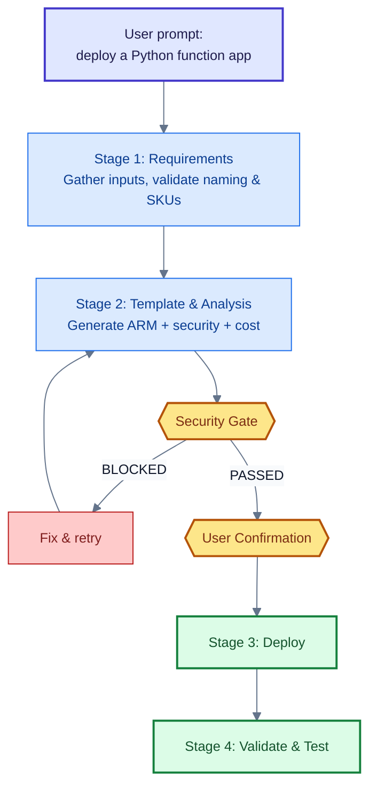

# Git-Ape

:::warning
**EXPERIMENTAL PROJECT:** Git-Ape is in active development and is not production-ready. Use it for local development, demos, sandbox subscriptions, and learning only.
:::

Git-Ape is a **platform engineering framework** built on GitHub Copilot. It provides a structured, multi-agent system for planning, validating, and deploying **any Azure workload** — with security gates, cost analysis, and CI/CD pipeline integration built in.

It is the implementation of the thesis Microsoft published in [Platform Engineering for the Agentic AI Era](https://devblogs.microsoft.com/all-things-azure/platform-engineering-for-the-agentic-ai-era/) — agents and policy replacing module catalogues as the platform team's primary deliverable. See the **[Vision & Manifesto](./vision)** for the full thinking.

## What it does

- **Gather deployment requirements** through guided conversations
- **Generate ARM templates** and supporting deployment artifacts
- **Run security, preflight, and cost checks** before deployment
- **Deploy and validate** with post-deployment health checks
- **Manage lifecycle** with drift detection and teardown workflows

## How it works

Git-Ape enforces compliance at three layers — generation, plan, and runtime — so non-compliant code never reaches your subscription. See [Vision & Manifesto → Three layers of enforcement](./vision#how-it-works--three-layers-of-enforcement).

## Deployment Flow



## Execution Modes

Git-Ape works in two modes:

- **Interactive (VS Code)** — Talk to `@git-ape` in Copilot Chat, authenticate via `az login`, approve each step in real time.
- **Headless (Coding Agent)** — Copilot Coding Agent picks up a GitHub Issue, generates templates on a branch, opens a PR, and CI/CD workflows handle the rest.

## Quick Start

Visual Studio Code Extension: 

[](https://marketplace.visualstudio.com/items?itemName=Git-ApeTeam.git-ape) [](vscode:extension/Git-ApeTeam.git-ape) [](vscode-insiders:extension/Git-ApeTeam.git-ape)

Or GitHub Copilot CLI:

```bash
# Install the plugin (VS Code Marketplace is the one-click route above)
# Copilot CLI route:
copilot plugin marketplace add Azure/git-ape
copilot plugin install git-ape@git-ape
copilot plugin list   # Should show: git-ape@git-ape

# Check prerequisites
# In Copilot Chat: /prereq-check

# Deploy something
# In Copilot Chat: @git-ape deploy a Python function app
```

See [Installation & Prerequisites](./getting-started/installation) for every install path.

## Next Steps

- [Vision & Manifesto](./vision) — why Git-Ape exists and how it relates to module-first platforms
- [Installation & Prerequisites](./getting-started/installation)
- [Azure MCP Setup](./getting-started/azure-setup)

### Who Is This For?

- [Executives & CxOs](./personas/for-executives) — governance, cost visibility, compliance
- [Engineering Leads](./personas/for-engineering-leads) — self-service, architecture standards
- [DevOps Engineers](./personas/for-devops) — CI/CD pipelines, OIDC, drift detection
- [Platform Engineers](./personas/for-platform-engineering) — guardrails, naming, policy
- [Individual Engineers](./personas/for-engineers) — quick start, skill cheatsheet

### Popular Use Cases

- [Deploy anything](./use-cases/deploy-anything)
- [Security Analysis](./use-cases/security-analysis)
- [CI/CD Pipeline](./use-cases/cicd-pipeline)
- [Headless / Coding Agent Mode](./use-cases/headless-mode)

### Deep Dives

- [Agents Overview](./agents/overview)
- [Skills Overview](./skills/overview)
- [CI/CD Workflows](./workflows/overview)
