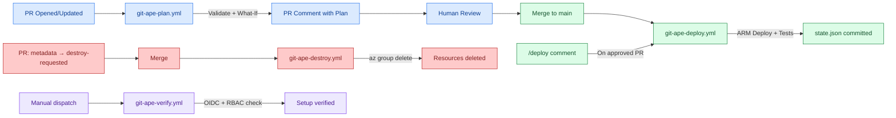
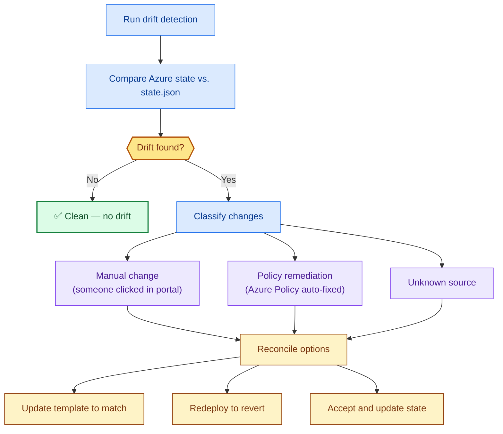

# Git-Ape for DevOps & SRE

> **TL;DR** — Git-Ape provides four GitHub Actions workflows for the full deployment lifecycle: plan-on-PR, deploy-on-merge, destroy-on-request. OIDC auth, no stored secrets, drift detection included.

:::info[Why this matters]
The [Git-Ape manifesto](/docs/vision) frames GitHub as the new control plane: context, instructions, agents, validation, and cloud enforcement layered together. **Drift remediation becomes continuous** — agents detect drift, propose fixes, generate plans, request approval, and apply remediations.

The gap between observability and action collapses.
:::

<FeatureGrid columns={4}>
  <MetricCard value="4" label="CI/CD Workflows" icon="fas fa-code-branch" />
  <MetricCard value="OIDC" label="Authentication" icon="fas fa-key" />
  <MetricCard value="0" label="Stored Secrets" icon="fas fa-lock" />
  <MetricCard value="Auto" label="Drift Detection" icon="fas fa-exchange-alt" />
</FeatureGrid>

## CI/CD Pipeline Architecture



## OIDC Setup (Zero Stored Secrets)

Git-Ape uses OIDC federated identity — the GitHub Actions runner exchanges a short-lived token for an Azure access token at deploy time. No `AZURE_CREDENTIALS` JSON blob.

**Required GitHub secrets** (identifiers only, not credentials):

| Secret | Purpose |
|--------|---------|
| `AZURE_CLIENT_ID` | App Registration's client ID |
| `AZURE_TENANT_ID` | Azure AD tenant ID |
| `AZURE_SUBSCRIPTION_ID` | Target subscription ID |

**Federated credential config:**

```
Issuer:   https://token.actions.githubusercontent.com
Subject:  repo:{org}/{repo}:ref:refs/heads/main
Audience: api://AzureADTokenExchange
```

:::tip[Automated Setup]
Use `@git-ape-onboarding` to configure OIDC, RBAC, GitHub environments, and secrets in one guided session.
:::

## Workflow Deep Dive

### git-ape-plan.yml (PR validation)

**Triggers:** PR opened/updated with changes to `.azure/deployments/**/template.json`

1. Detect which deployment directories changed
2. Login to Azure via OIDC
3. Validate ARM template (`az deployment sub validate`)
4. Run what-if analysis (`az deployment sub what-if`)
5. Post detailed plan as PR comment (architecture diagram + what-if + validation)

### git-ape-deploy.yml (Execution)

**Triggers:** Push to `main` with deployment changes OR `/deploy` comment on approved PR

1. OIDC login
2. Validate template
3. `az deployment sub create`
4. Run integration tests (list resources, test HTTP endpoints)
5. Commit `state.json` with deployment result
6. Post result as PR comment

### git-ape-destroy.yml (Teardown)

**Triggers:** Push to `main` where `metadata.json` status changed to `destroy-requested`

1. Read `state.json` for resource group name
2. Inventory all resources
3. `az group delete` (synchronous, waits for completion)
4. Update `state.json` and `metadata.json` → `destroyed`

## Drift Detection



## GitHub Environment Setup

Create two protected environments:

| Environment | Purpose | Protection Rules |
|-------------|---------|------------------|
| `azure-deploy` | Deployment target | Required reviewers (optional for prod), branches: `main` only |
| `azure-destroy` | Teardown target | Required reviewers (recommended), branches: `main` only |

## Next Steps

- [Onboarding Guide](/docs/getting-started/onboarding)
- [CI/CD Pipeline Setup](/docs/use-cases/cicd-pipeline)
- [Drift Detection Guide](/docs/use-cases/drift-detection)
- [Workflow Reference](/docs/workflows/overview)
