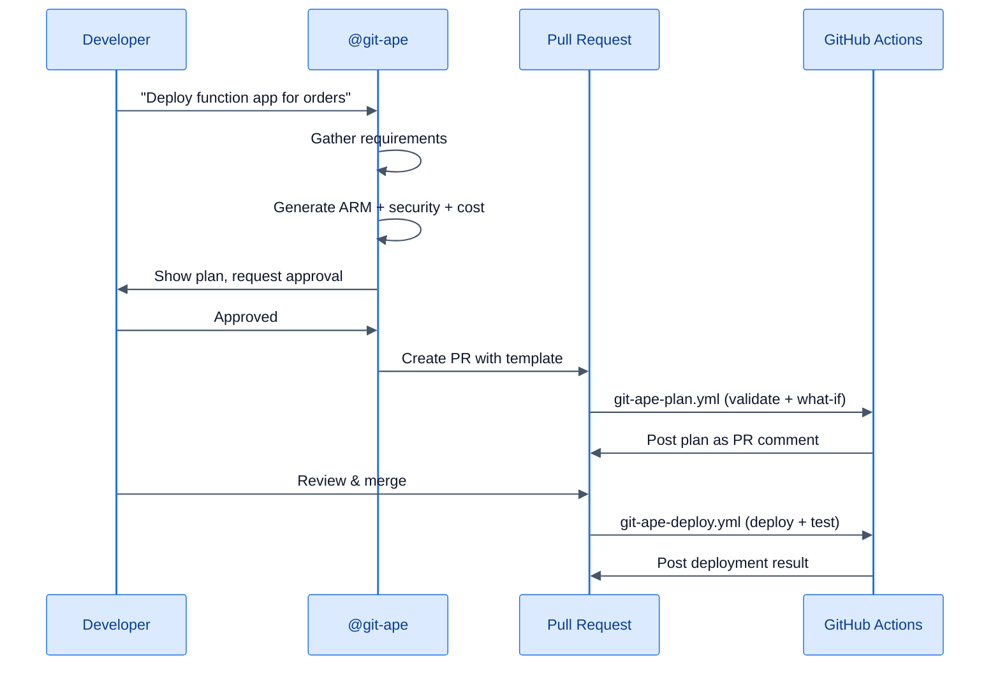

# Git-Ape for Engineering Leads

> **TL;DR** — Git-Ape automates Azure infrastructure quality so your team ships faster with fewer production incidents. No Azure expertise required from every developer.

:::info[Why this matters]
The [Git-Ape manifesto](/docs/vision) describes how the interaction layer collapses from CLIs, wrappers, and pipeline glue into a single intelligent layer. Your developers describe **what** they want; the agent handles **how** to express it safely.

Fewer experts needed per repo. Same security baseline whether the deployment is built by a junior dev or a principal engineer.
:::

<FeatureGrid columns={3}>
  <MetricCard value="8" label="AI Agents" icon="fas fa-robot" />
  <MetricCard value="34" label="Built-in Skills" icon="fas fa-puzzle-piece" />
  <MetricCard value="100%" label="Auto-documented" icon="fas fa-file-alt" />
</FeatureGrid>

## The Problem You Face

Your team needs to deploy Azure resources, but not everyone is an Azure expert. The current options are:

- **Developers write their own ARM templates** — inconsistent quality, security gaps
- **Platform team becomes a bottleneck** — ticket-based provisioning slows everyone down
- **Copy-paste from old deployments** — works until it doesn't, no security guarantees

## How Git-Ape Solves It

### Self-Service with Guardrails

Developers describe what they need in natural language. Git-Ape handles the rest:

```
@git-ape deploy a Python Function App with Cosmos DB
         for the order-processing service in dev
```

The system automatically:
1. Validates naming against CAF conventions
2. Generates ARM templates with security best practices
3. Runs blocking security gate (no shortcuts)
4. Estimates costs before deploying
5. Runs integration tests after deployment
6. Commits deployment state to the repo

### Architecture Quality Automation

The **Principal Architect** agent evaluates every deployment against the Well-Architected Framework:

| Pillar | What It Checks |
|--------|----------------|
| Security | Managed identities, encryption, RBAC, network isolation |
| Reliability | Redundancy, health probes, backup configuration |
| Performance | SKU sizing, scaling rules, caching strategies |
| Cost | Right-sizing, reserved instances, dev/test pricing |
| Operations | Monitoring, logging, alerting, diagnostics |

### Team Enablement Patterns

- **Living documentation** — auto-generated from agent and skill source files
- **Two execution modes** — interactive for learning, headless for CI/CD automation
- **Consistent deployments** — same security baseline whether deployed by a junior dev or a principal engineer

## Integration with Your Workflow



## Next Steps

- [Quick Start for Engineers](/docs/personas/for-engineers)
- [Deploy anything](/docs/use-cases/deploy-anything)
- [CI/CD Pipeline Setup](/docs/use-cases/cicd-pipeline)
- [Agents Overview](/docs/agents/overview)
