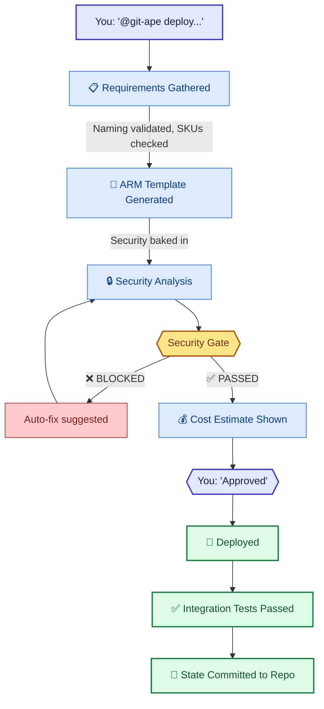

# Git-Ape for Engineers

> **TL;DR** — Type `@git-ape deploy a Python function app` in VS Code Copilot Chat. It handles the rest — naming, security, cost, deployment, and testing.

:::info[Why this matters]
The [Git-Ape manifesto](/docs/vision) puts it simply: **interaction shifts from syntax to intent.** You describe what you want; the agent reasons over live Azure API specs and generates compliant code.

No more memorizing CAF naming conventions, ARM property paths, or RBAC role IDs.
:::

## 5-Minute Quick Start

### Step 1: Install

```bash
copilot plugin marketplace add Azure/git-ape
copilot plugin install git-ape@git-ape
copilot plugin li
```

### Step 2: Check Prerequisites

In Copilot Chat:

```
/prereq-check
```

This verifies: Azure CLI, GitHub CLI, Node.js, active auth sessions.

### Step 3: Deploy Something

```
@git-ape deploy a Python Function App with Storage
         and App Insights for the data-pipeline project in dev
```

That's it. Git-Ape handles everything else.

## What Happens Behind the Scenes



## Conversation Examples

### Deploy a Function App

```
You:     @git-ape deploy a Python Function App for order processing
Git-Ape: I'll gather the requirements. What environment? (dev/staging/prod)
You:     dev
Git-Ape: What region? (eastus/westus2/westeurope)
You:     eastus
Git-Ape: [generates template, runs security analysis, shows cost]
         Security Gate: ✅ PASSED | Estimated Cost: $12.50/mo
         Ready to deploy?
You:     yes
Git-Ape: ✅ Deployed! Resources created in rg-orderproc-dev-eastus
```

### Check Drift

```
You:     @git-ape check drift for the order-processing deployment
Git-Ape: Scanning... 2 drift items found:
         1. Storage account: firewall rules added (manual change)
         2. Function App: new app setting added (policy remediation)
         Options: update template / revert / accept
```

### Import Existing Resources

```
You:     @azure-iac-exporter export rg-legacy-app-prod
Git-Ape: Analyzing 12 resources... ARM template generated at
         .azure/deployments/legacy-app-prod/template.json
```

## Skill Cheatsheet

| Need | Command | What It Does |
|------|---------|-------------|
| Deploy resources | `@git-ape deploy ...` | Full deployment workflow |
| Check prereqs | `/prereq-check` | Verify CLI tools and auth |
| Architecture review | `@azure-principal-architect review my deployment` | WAF 5-pillar assessment |
| Policy check | `@azure-policy-advisor assess my template` | Azure Policy compliance |
| Export existing | `@azure-iac-exporter export {rg-name}` | Reverse-engineer to ARM |
| Onboard repo | `@git-ape-onboarding` | Set up OIDC, RBAC, environments |
| Name lookup | `/azure-naming-research "Azure Functions"` | CAF abbreviation and rules |
| Cost estimate | `/azure-cost-estimator` | Per-resource pricing |

## Common Issues

### "Security Gate BLOCKED"

The security gate found Critical or High severity issues. Git-Ape will suggest auto-fixes. Accept them and re-run analysis.

### "az login required"

Run `az login` in your terminal. Git-Ape needs an active Azure CLI session for interactive mode.

### "Naming conflict"

A resource with that name already exists. Try a different project name or environment suffix.

## Next Steps

- [Installation Guide](/docs/getting-started/installation)
- [Deploy anything](/docs/use-cases/deploy-anything)
- [All Agents](/docs/agents/overview)
- [All Skills](/docs/skills/overview)
