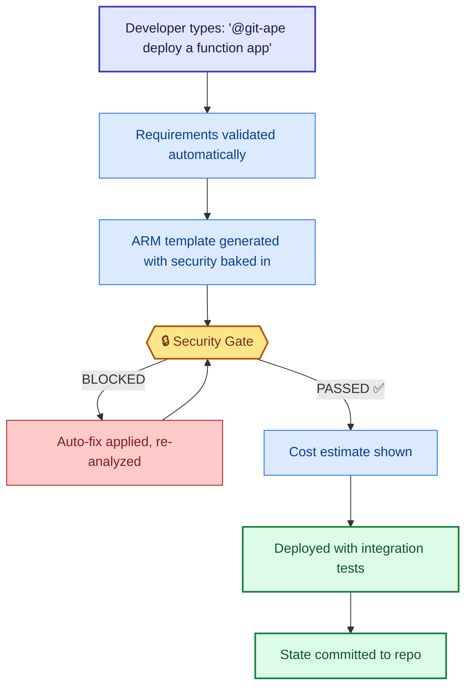

# Git-Ape for Executives

> **TL;DR** — Git-Ape gives you automated compliance, cost visibility, and security enforcement for every Azure deployment — without slowing down your engineering teams.

:::info[Why this matters]
In the [Git-Ape manifesto](/docs/vision), compliance shifts from a gate teams pass through to something **inherent in the process**. Every deployment produces a verifiable trail — intent → plan → API calls → validation → evidence — reviewed and approved like any other change.

This is what "continuous compliance" looks like in practice.
:::

<FeatureGrid columns={3}>
  <MetricCard value="100%" label="Security Enforced" icon="fas fa-shield-alt" />
  <MetricCard value="5" label="WAF Pillars Assessed" icon="fas fa-balance-scale" />
  <MetricCard value="$0" label="Surprise Cloud Bills" icon="fas fa-dollar-sign" />
</FeatureGrid>

## Why It Matters

Every Azure deployment your teams make goes through a **blocking security gate** — no exceptions, no shortcuts. Git-Ape enforces security best practices, estimates costs before spending, and generates compliance reports automatically.

### Compliance Without Friction

- **Azure Policy assessment** against CIS, NIST, and custom frameworks
- **Security gate** blocks deployments until all Critical and High severity checks pass
- **Audit trail** — every deployment decision is committed to your repository as code
- **WAF 5-pillar scoring** for Security, Reliability, Performance, Cost, and Operational Excellence

### Cost Governance

- **Pre-deployment cost estimation** using Azure Retail Prices API
- Per-resource cost breakdown with monthly totals
- No more discovering unexpected charges after the fact

### Risk Reduction

- **Managed identities only** — no connection strings or shared keys
- **Least-privilege RBAC** enforced via automated role selection
- **Drift detection** identifies unauthorized manual changes to deployed resources
- **OIDC authentication** — no stored secrets in CI/CD pipelines

## What Your Teams See

## Key Reports You Get

| Report | What It Shows |
|--------|---------------|
| Security Analysis | Per-resource security posture with severity ratings |
| Cost Estimation | Monthly cost breakdown by resource with retail pricing |
| WAF Assessment | 5-pillar scores with specific recommendations |
| Policy Compliance | Alignment with Azure Policy initiatives (CIS, NIST) |
| Drift Detection | Manual changes vs. desired state with reconciliation options |

## Next Steps

- [How It Works — Full Deployment Flow](/docs/intro)
- [Security Analysis Deep Dive](/docs/use-cases/security-analysis)
- [Cost Estimation Walkthrough](/docs/use-cases/cost-estimation)
- [WAF Review Process](/docs/use-cases/waf-review)
