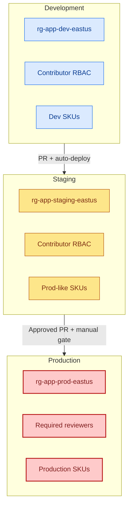
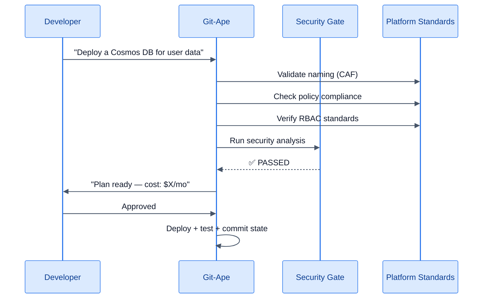

# Git-Ape for Platform Engineering

> **TL;DR** — Git-Ape is your self-service deployment platform with built-in guardrails. Developers deploy independently while you maintain security, naming, policy, and cost standards.

:::info[Why this matters]
The [Git-Ape manifesto](/docs/vision) argues that the platform team's deliverable is no longer "here's a module, good luck with the 47 variables." It is **"here's an agent that knows our entire infrastructure context and generates compliant code on demand."**

Guardrails move into the agent. Modules become knowledge. Drift remediation becomes continuous.
:::

<FeatureGrid columns={3}>
  <MetricCard value="CAF" label="Naming Enforced" icon="fas fa-tag" />
  <MetricCard value="RBAC" label="Least Privilege" icon="fas fa-user-shield" />
  <MetricCard value="Policy" label="Auto-Assessed" icon="fas fa-clipboard-list" />
</FeatureGrid>

## The Platform Engineer's Dilemma

You want developers to be self-service, but you also need:
- Consistent naming across all resources
- Security baselines enforced on every deployment
- Cost visibility before resources are created
- Policy compliance without manual review

Git-Ape solves this by embedding platform engineering standards directly into the deployment conversation.

## Built-in Guardrails

### Naming Standards

Every resource name is validated against Azure Cloud Adoption Framework (CAF) conventions:

```
Format: {caf-abbrev}-{project}-{environment}-{region}

Examples:
  func-orderapi-dev-eastus      ← Function App
  st-orderapi-dev-8k3m          ← Storage Account
  kv-orderapi-prod-eus          ← Key Vault
```

The `azure-naming-research` skill automatically:
- Looks up CAF abbreviations for the resource type
- Validates length constraints (min/max characters)
- Checks valid character sets
- Verifies uniqueness scope (global, resource group, subscription)

### Security Guardrails

| Guardrail | Enforcement |
|-----------|-------------|
| Managed identities | Always — no connection strings |
| Shared key access | Disabled on storage accounts |
| FTP state | Disabled on all App Services |
| TLS version | Minimum 1.2 everywhere |
| HTTPS only | Enforced on all web-facing resources |
| AAD-only auth | Enabled on SQL databases |
| Key Vault references | Used for all secrets in app settings |

### Policy Compliance

The `azure-policy-advisor` skill assesses ARM templates against:
- **CIS Azure Foundations v3.0**
- **NIST SP 800-53 Rev 5**
- Custom organizational policies
- Existing subscription-level policy assignments

Output includes specific recommendations with built-in policy definition IDs.

## Multi-Environment Management



Each environment gets:
- Separate resource groups with environment-specific naming
- Appropriate RBAC assignments
- Environment-specific SKU sizing
- GitHub environment protection rules (optional reviewers for prod)

## Self-Service Workflow



Developers get self-service speed. You get governance and compliance. No ticket queue.

## Next Steps

- [Naming Research Skill](/docs/skills/azure-naming-research)
- [Security Analysis Skill](/docs/skills/azure-security-analyzer)
- [Policy Advisor Skill](/docs/skills/azure-policy-advisor)
- [Multi-Environment Guide](/docs/use-cases/multi-environment)
