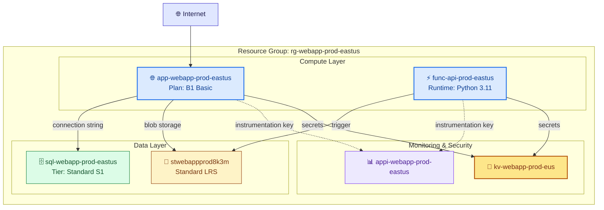

<!-- AUTO-GENERATED — DO NOT EDIT. Source: .github/skills/azure-resource-visualizer/SKILL.md -->


# Azure Resource Visualizer

> Analyze deployed Azure resource groups and generate detailed Mermaid architecture diagrams showing relationships between resources. Use for post-deployment visualization, understanding existing infrastructure, or documenting live Azure environments.

## Details

| Property | Value |
|----------|-------|
| **Skill Directory** | `.github/skills/azure-resource-visualizer/` |
| **Phase** | Post-Deploy |
| **User Invocable** | ✅ Yes |
| **Usage** | `/azure-resource-visualizer Resource group name to visualize` |


## Documentation

# Azure Resource Visualizer

Analyze deployed Azure resource groups and generate comprehensive Mermaid architecture diagrams showing resource relationships, configurations, and data flows.

Adapted from [github/awesome-copilot](https://github.com/github/awesome-copilot) `azure-resource-visualizer` skill.

## When to Use

- After deployment to visualize what was created
- To understand existing Azure infrastructure
- For documentation and architecture reviews
- During drift detection to compare expected vs actual architecture
- When user asks "show me my Azure resources" or "diagram my infrastructure"

## Procedure

### 1. Select Resource Group

If not specified, list available resource groups:

```bash
az group list \
  --query "[].{Name:name, Location:location, Tags:tags}" \
  --output table
```

Present a numbered list and ask the user to select.

### 2. Discover All Resources

Query all resources in the selected resource group:

```bash
az resource list \
  --resource-group {rg-name} \
  --query "[].{Name:name, Type:type, Location:location, SKU:sku.name, Kind:kind}" \
  --output json
```

For each resource, gather details:
- Resource name and type
- SKU/tier information
- Key configuration properties
- Network settings (VNets, subnets, private endpoints)
- Identity (Managed Identity, RBAC)
- Dependencies and connections

### 3. Map Relationships

Identify connections between resources:

| Relationship Type | How to Detect |
|-------------------|---------------|
| **Network** | VNet peering, subnet assignments, NSG rules, private endpoints |
| **Data flow** | App → Database connection strings, Function → Storage bindings |
| **Identity** | Managed identity role assignments |
| **Configuration** | App Settings referencing Key Vault, instrumentation keys |
| **Dependencies** | Parent-child relationships (SQL Server → Database) |

### 4. Generate Mermaid Diagram

Create a detailed diagram using `graph TB` or `graph LR`:



**Diagram Rules:**
- Group by layer: Compute, Data, Monitoring & Security, Network
- Include resource details in node labels (SKU, tier, runtime) using `<br/>`
- Use icons: 🌐 web, ⚡ function, 💾 storage, 🗄️ database, 📊 monitoring, 🔑 key vault, 🐳 container
- Label all connections with relationship type
- `-->` for data flow/dependencies, `-.->` for optional/monitoring, `==>` for critical paths
- Use `subgraph` for logical grouping

### 5. Create Documentation

Generate a markdown file named `{rg-name}-architecture.md`:

```markdown
# Architecture: {rg-name}

**Subscription:** {subscription-name}
**Region:** {location}
**Analyzed:** {timestamp}

## Overview

{2-3 paragraph summary of the architecture}

## Architecture Diagram

{mermaid diagram}

## Resource Inventory

| # | Resource | Type | SKU | Location | Tags |
|---|----------|------|-----|----------|------|
| 1 | app-webapp-prod | App Service | B1 | East US | env=prod |
| 2 | sql-webapp-prod | SQL Server | S1 | East US | env=prod |
| ... | ... | ... | ... | ... | ... |

## Relationships

| Source | Target | Connection Type | Details |
|--------|--------|-----------------|---------|
| App Service | SQL Server | Connection String | SQL authentication |
| App Service | Storage | Blob Access | Managed Identity |
| Function App | Storage | Queue Trigger | Storage binding |

## Notes

- {observations about the architecture}
- {potential improvements}
- {security considerations}
```

### 6. Save or Display

- **If called from Git-Ape workflow**: Save to `.azure/deployments/{id}/architecture-live.md`
- **If called standalone**: Save to workspace root or `docs/` folder
- Display summary to user with resource count and key relationships

## Integration with Git-Ape

**Post-deployment visualization:**
```
Deployment succeeds → /azure-resource-visualizer {rg-name} → Live architecture diagram
```

**Drift detection enhancement:**
```
/azure-drift-detector detects drift → /azure-resource-visualizer → Compare expected vs actual diagram
```

**Import workflow:**
```
/azure-iac-exporter imports resources → /azure-resource-visualizer → Document imported architecture
```

## Constraints

- **Read-only** — never modify Azure resources
- **Complete** — include ALL resources in the resource group, don't skip any
- **Accurate** — verify resource details before including in diagram
- **Valid Mermaid** — ensure diagram syntax renders correctly
