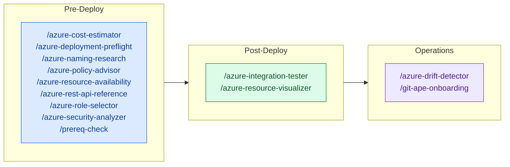

<!-- AUTO-GENERATED — DO NOT EDIT. Source: .github/skills/ -->

# Skills Overview

Skills are focused capabilities invoked by agents at specific stages of the deployment workflow. Each skill handles one task.

## Pre-Deploy Skills

| Skill | Description | Invocable |
|-------|-------------|:---------:|
| [Azure Cost Estimator](./azure-cost-estimator) | Estimate monthly costs for Azure resources by querying the Azure Retail Prices API. Parses ARM templates to identify resources, SKUs, and regions, then looks up real retail pricing. Produces a per-resource cost breakdown with monthly totals. Use during template generation or when user asks about costs. | ✅ |
| [Azure Deployment Preflight](./azure-deployment-preflight) | Run preflight validation on ARM templates before deployment. Performs what-if analysis, permission checks, and generates a structured report with resource changes (create/modify/delete). Use before any deployment to preview changes and catch issues early. | ✅ |
| [Azure Naming Research](./azure-naming-research) | Research Azure naming constraints and CAF abbreviations for a given resource type. Use when you need to look up the official CAF slug, naming rules (length, scope, valid characters), and derive validation/cleaning regex patterns for an Azure resource. Triggers on: CAF abbreviation lookup, Azure naming rules research, resource naming constraints. | ✅ |
| [Azure Policy Advisor](./azure-policy-advisor) | Assess Azure Policy compliance for ARM template resources. Queries existing subscription assignments and unassigned custom/built-in definitions, cross-references with Microsoft Learn recommendations. Produces per-resource policy recommendations with implementation options. | ✅ |
| [Azure Resource Availability](./azure-resource-availability) | Query live Azure APIs to validate resource availability before template generation or deployment. Checks VM SKU restrictions, Kubernetes/runtime version support, API version compatibility, and subscription quota. Use during requirements gathering and preflight to catch deployment failures early. | ✅ |
| [Azure Rest Api Reference](./azure-rest-api-reference) | Look up Azure REST API and ARM template reference documentation for any resource type. Returns exact property schemas, required fields, valid values, and latest stable API versions. Use BEFORE generating or modifying ARM templates to ensure correctness. No Azure connection required. | ✅ |
| [Azure Role Selector](./azure-role-selector) | Recommend least-privilege Azure RBAC roles for deployed resources. Finds minimal built-in roles matching desired permissions or creates custom role definitions. Use during security analysis or when configuring access for service principals and managed identities. | ✅ |
| [Azure Security Analyzer](./azure-security-analyzer) | Analyze Azure resource configurations against security best practices using Azure MCP bestpractices service. Produces per-resource security assessment with severity ratings and recommendations. Use during template generation before deployment confirmation. | ✅ |
| [Prereq Check](./prereq-check) | Validate Git-Ape CLI tool installation (az, gh, jq, git), versions, and auth sessions. Shows platform-specific install commands for anything missing. USE FOR: check Git-Ape prerequisites, what do I need to install for Git-Ape, verify Git-Ape CLI tools, az: command not found, gh: command not found, jq: command not found, git: command not found, az missing, gh missing, jq missing, git missing, fresh machine setup for Git-Ape, dev container setup for Git-Ape, before running git-ape-onboarding, az login required, gh auth login, auth expired, not logged in, outdated az version, minimum az version, upgrade az. DO NOT USE FOR: Anything else. This skill is narrowly scoped to prerequisites checks for Git-Ape's CLI tools and auth sessions. Do not use it for any other purpose. | ✅ |

## Post-Deploy Skills

| Skill | Description | Invocable |
|-------|-------------|:---------:|
| [Azure Integration Tester](./azure-integration-tester) | Run post-deployment integration tests for Azure resources. Verify Function Apps, Storage Accounts, Databases, App Services are healthy and accessible. Use after successful Azure deployment. | ✅ |
| [Azure Resource Visualizer](./azure-resource-visualizer) | Analyze deployed Azure resource groups and generate detailed Mermaid architecture diagrams showing relationships between resources. Use for post-deployment visualization, understanding existing infrastructure, or documenting live Azure environments. | ✅ |

## Operations Skills

| Skill | Description | Invocable |
|-------|-------------|:---------:|
| [Azure Drift Detector](./azure-drift-detector) | Detect configuration drift between deployed Azure resources and stored deployment state. Compare actual Azure configuration against desired state in .azure/deployments/, identify differences, and guide user through reconciliation options. Use when checking for manual changes, policy remediations, or unauthorized modifications. | ✅ |
| [Git Ape Onboarding](./git-ape-onboarding) | Onboard a repository, Azure subscription(s), and user identity for Git-Ape CI/CD using a skill-driven CLI playbook. Use for first-time setup of OIDC, federated credentials, RBAC, GitHub environments, and required secrets. | ✅ |

## General Skills

| Skill | Description | Invocable |
|-------|-------------|:---------:|
| [Azure Stack Deploy](./azure-stack-deploy) | Deploy an ARM template as a subscription-scoped Azure Deployment Stack (idempotent across resource groups and sub-scope). Captures managed resources, classifies soft-deletable types, detects Key Vault purge protection, and writes extended state.json (schemaVersion 1.0). Use for any local CLI / VS Code Git-Ape deployment so the result matches the CI workflow. | ✅ |
| [Azure Stack Destroy](./azure-stack-destroy) | Destroy a Git-Ape deployment by deleting its Azure Deployment Stack with --action-on-unmanage deleteAll, then purging soft-deleted resources (Key Vault, Cognitive Services) that are not purge-protected. Reads state.json (schemaVersion 1.0) to know exactly what to clean up. Use for any local CLI / VS Code Git-Ape teardown so the result matches the CI workflow. | ✅ |

## Skill Invocation in Deployment Flow

