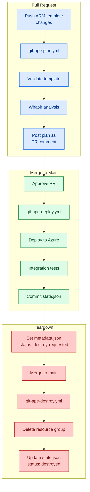

# CI/CD Pipeline

> **TL;DR** — Git-Ape provides three GitHub Actions workflows: `git-ape-plan` (validate on PR), `git-ape-deploy` (deploy on merge), and `git-ape-destroy` (tear down on request). All use OIDC — no stored secrets.

## Pipeline Architecture



## Workflow Details

### `git-ape-plan.yml` — Validate and Preview

**Triggers:** PR opened or updated with changes to `.azure/deployments/**/template.json`

| Step | Action |
|------|--------|
| 1 | Detect changed deployment directories |
| 2 | Login to Azure via OIDC |
| 3 | Validate ARM template (`az deployment sub validate`) |
| 4 | Run what-if analysis (`az deployment sub what-if`) |
| 5 | Post plan as PR comment with architecture diagram |

### `git-ape-deploy.yml` — Execute Deployment

**Triggers:** Push to `main` (PR merge) or `/deploy` comment on approved PR

| Step | Action |
|------|--------|
| 1 | Login to Azure via OIDC |
| 2 | Validate template (safety re-check) |
| 3 | Deploy (`az deployment sub create`) |
| 4 | Run integration tests |
| 5 | Commit `state.json` to repo |

### `git-ape-destroy.yml` — Tear Down

**Triggers:** Push to `main` with `metadata.json` status changed to `destroy-requested`

| Step | Action |
|------|--------|
| 1 | Read `state.json` for resource group name |
| 2 | Inventory all resources |
| 3 | Delete resource group (synchronous) |
| 4 | Update state to `destroyed`, commit |

## OIDC Authentication

All workflows use OpenID Connect (OIDC) federated identity — no stored secrets:

```yaml
permissions:
  id-token: write
  contents: write

steps:
  - uses: azure/login@v2
    with:
      client-id: ${{ secrets.AZURE_CLIENT_ID }}
      tenant-id: ${{ secrets.AZURE_TENANT_ID }}
      subscription-id: ${{ secrets.AZURE_SUBSCRIPTION_ID }}
```

## Related

- [Workflows: git-ape-plan](/docs/workflows/git-ape-plan)
- [Workflows: git-ape-deploy](/docs/workflows/git-ape-deploy)
- [Workflows: git-ape-destroy](/docs/workflows/git-ape-destroy)
- [Onboarding Guide](/docs/getting-started/onboarding)
- [For DevOps](/docs/personas/for-devops)
