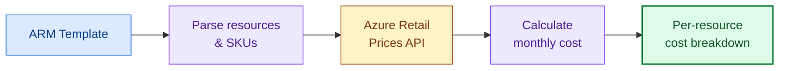

# Cost Estimation

> **TL;DR** — Git-Ape estimates monthly costs for every resource before deployment by querying the Azure Retail Prices API. No surprises.

## How It Works



The `azure-cost-estimator` skill:

1. **Parses** the ARM template to identify resource types, SKUs, and regions
2. **Queries** the Azure Retail Prices API for current retail pricing
3. **Calculates** estimated monthly costs per resource
4. **Produces** a formatted breakdown with totals

## Example Output

| Resource | Type | SKU | Region | Monthly Cost |
|----------|------|-----|--------|-------------|
| func-api-dev-eastus | Function App | Consumption (Y1) | East US | $0.00 |
| stfuncapidev8k3m | Storage Account | Standard LRS | East US | $2.40 |
| appi-api-dev-eastus | Application Insights | Pay-as-you-go | East US | $2.30 |
| log-api-dev-eastus | Log Analytics | Pay-as-you-go | East US | $2.76 |
| | | | **Total** | **$7.46/mo** |

:::tip
Costs are estimates based on retail pricing. Actual costs depend on usage patterns, reserved instances, and enterprise agreements.
:::

## When It Runs

Cost estimation runs automatically as part of the deployment workflow:

1. Template generated → **Cost estimator invoked**
2. Security gate checked
3. Cost shown to user in the approval prompt
4. User approves (or requests changes)

You can also invoke it directly:

```
/azure-cost-estimator
```

## Related

- [Skills: Azure Cost Estimator](/docs/skills/azure-cost-estimator)
- [Deploy anything](/docs/use-cases/deploy-anything)
- [For Executives](/docs/personas/for-executives)
