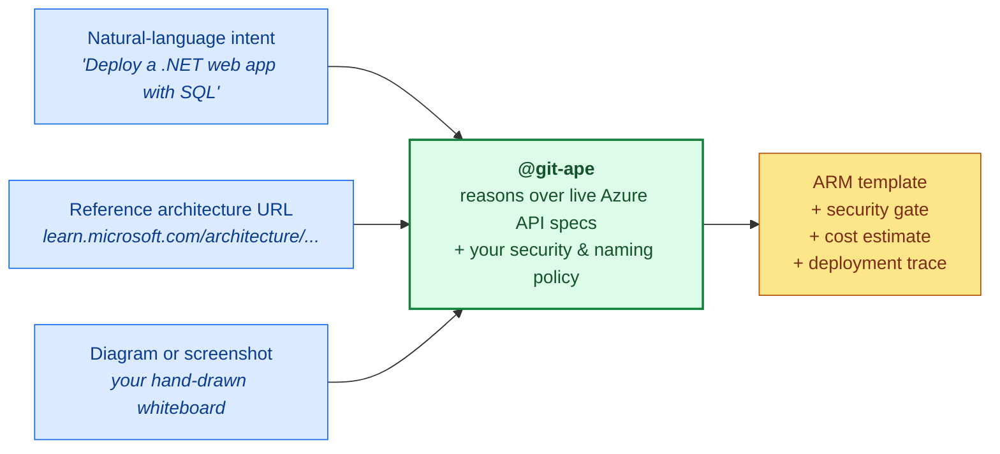
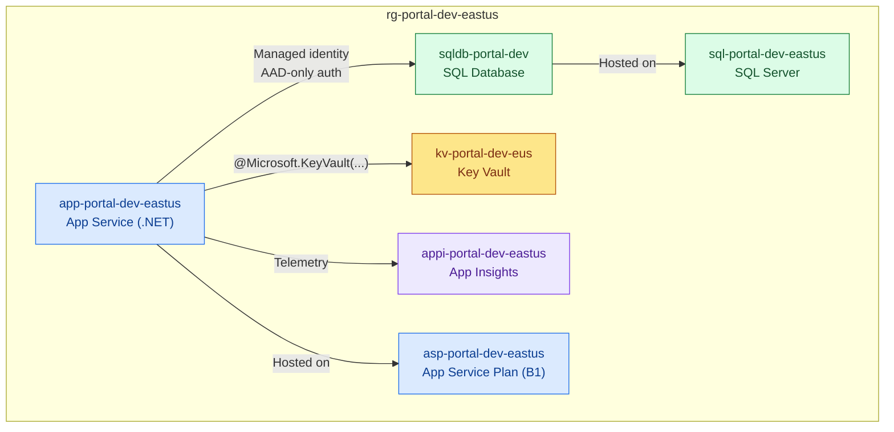
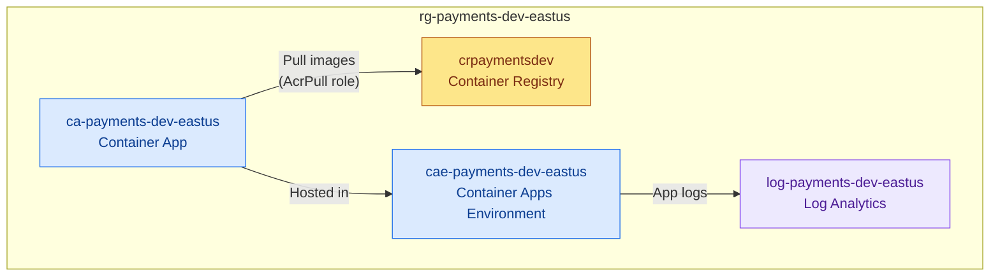
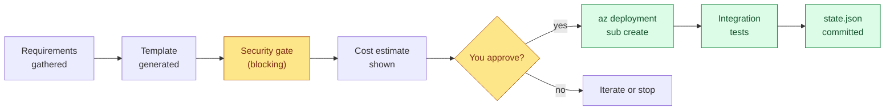

# Deploy anything

> **TL;DR** — Tell `@git-ape` what you want, in plain language. Or hand it a reference architecture link, diagram, or screenshot. Either way, it generates a CAF-compliant ARM template with security, cost, and policy enforced before deployment.

Git-Ape is **workload-agnostic**. If Azure Resource Manager can deploy it, the agent can generate it — using the live Azure REST API specs at generation time, not last year's module catalogue.

## Three ways to describe what you want



| Input | Example prompt |
|---|---|
| **Plain intent** | `@git-ape deploy a .NET web app with SQL Database for the customer portal in dev` |
| **Reference architecture** | `@git-ape implement this reference architecture: https://learn.microsoft.com/azure/architecture/reference-architectures/...` |
| **Diagram or picture** | Attach a PNG or markdown with mermaid, then: `@git-ape deploy what's in this diagram for the payments-api project` |

The agent reads the input, asks clarifying questions only when needed (region, environment, project name), and produces a full deployment plan you can review before approval.

---

## Example 1 — Web app with SQL Database

A common full-stack pattern: App Service with managed identity to SQL Database, secrets in Key Vault.



**Prompt:**

```text
@git-ape deploy a .NET web app with SQL Database and Key Vault
         for the customer-portal project in dev, eastus
```

**What you get:**

| Resource | Key settings enforced automatically |
|---|---|
| App Service | HTTPS-only, TLS 1.2, managed identity, FTP disabled |
| SQL Server | `azureADOnlyAuthentication: true` — no SQL username/password |
| SQL Database | Standard S1, geo-backup enabled |
| Key Vault | RBAC authorization, soft-delete + purge protection |
| RBAC | App Service → `SQL DB Contributor`, App Service → `Key Vault Secrets User` |

---

## Example 2 — Container Apps

A containerised microservice with auto-scaling, private registry, and centralised logging.



**Prompt:**

```text
@git-ape deploy a Container App with Registry and Log Analytics
         for the payments-api project in dev, eastus
```

**What you get:**

| Resource | Key settings enforced automatically |
|---|---|
| Container App | Min replicas: 0, max: 10, scale on HTTP concurrency |
| Container Apps Environment | Connected to Log Analytics workspace |
| Container Registry | Admin user disabled, managed identity pull only |
| RBAC | Container App → `AcrPull` on registry |
| Log Analytics | 30-day retention |

---

## Use a reference architecture as the source of truth

The Git-Ape [Vision](/docs/vision) describes a future state where governed documents — reference architectures, ADRs, security baselines — become the **ledger** that drives deployments. The agent's job is to compile those documents into compliant infrastructure.

You can do this today:

1. **Point the agent at a published Azure reference architecture URL.** The agent fetches it, identifies the resources, and produces an ARM template that matches.
2. **Attach a diagram or screenshot of an internal architecture pattern.** The agent reads the boxes and arrows and proposes a deployment.
3. **Reference an Architecture Decision Record (ADR) in your repo.** The agent treats the ADR as authoritative and validates the generated template against it.

```text
@git-ape deploy this reference architecture for the order-api project, dev:
https://learn.microsoft.com/azure/architecture/reference-architectures/...
```

Whatever you use as input, the agent produces the same artifacts: a CAF-compliant ARM template, a security analysis, a cost estimate, and a deployment trace under [`.azure/deployments/`](/docs/deployment/state) — your auditable evidence of intent → plan → outcome.

---

## What happens after you approve



See the full lifecycle in [State Management](/docs/deployment/state) and [CI/CD Pipeline](/docs/use-cases/cicd-pipeline).

---

## Related

- [Vision & Manifesto](/docs/vision) — why agents over modules
- [Security Analysis](/docs/use-cases/security-analysis) — what the security gate checks
- [Cost Estimation](/docs/use-cases/cost-estimation) — how pricing is computed
- [Skills overview](/docs/skills/overview) — every capability the agent invokes
