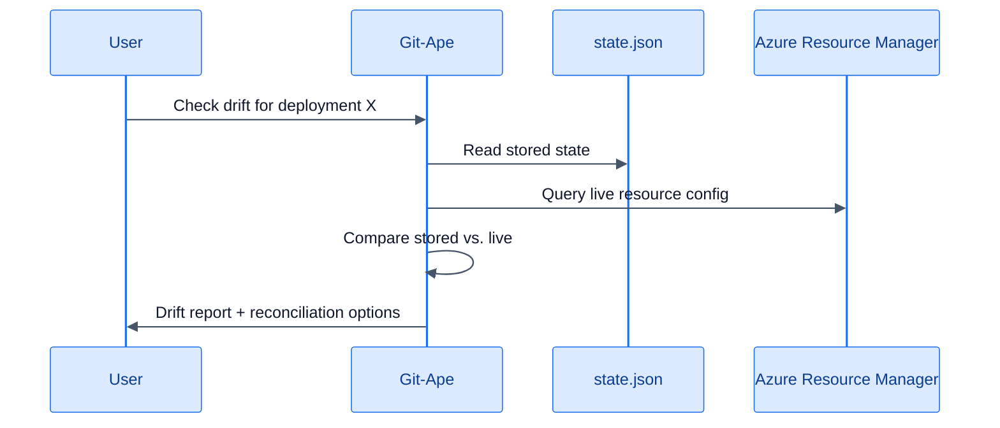

# Drift Detection

> **TL;DR** — Git-Ape compares your deployed Azure resources against the stored template state and identifies manual changes, policy remediations, or unauthorized modifications.

## How Drift Detection Works



## Invoke Drift Detection

```
@git-ape check drift for the order-api deployment
```

## Example Drift Report

```
🔍 Drift Report — rg-orderapi-dev-eastus

  Resources Scanned: 6
  Drift Items Found: 2

  1. Storage Account (storderapidev8k3m)
     Property: networkAcls.defaultAction
     Template: "Allow"  →  Live: "Deny"
     Cause: Likely Azure Policy remediation
     Options: [Update template] [Revert resource] [Accept drift]

  2. Function App (func-orderapi-dev-eastus)
     Property: siteConfig.appSettings
     Template: 5 settings  →  Live: 7 settings
     Added: WEBSITE_RUN_FROM_PACKAGE, FUNCTIONS_EXTENSION_VERSION
     Cause: Likely manual portal change
     Options: [Update template] [Revert resource] [Accept drift]
```

## Reconciliation Options

| Option | What It Does |
|--------|-------------|
| **Update template** | Modifies the ARM template to match live state. Commits change to repo. |
| **Revert resource** | Redeploys the stored template to reset the resource to desired state. |
| **Accept drift** | Acknowledges the change. Updates `state.json` to match live state. |

## When to Run

- **Scheduled audits** — weekly drift checks for production environments
- **Post-incident** — after a production issue to find manual fixes that need to be codified
- **Before redeployment** — ensure the stored template reflects actual state
- **Compliance reviews** — prove infrastructure matches approved templates

## Related

- [Skills: Azure Drift Detector](/docs/skills/azure-drift-detector)
- [Deployment State](/docs/deployment/state)
- [For DevOps](/docs/personas/for-devops)
