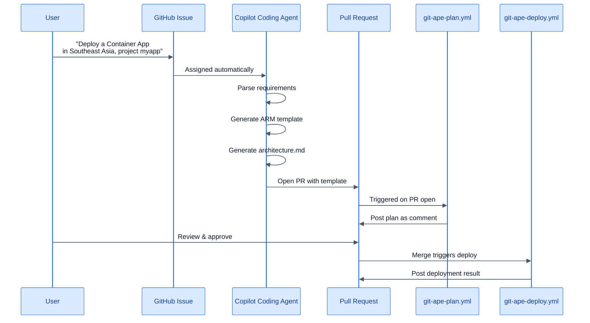

# Headless / Coding Agent Mode

> **TL;DR** — File a GitHub Issue describing your deployment. The Copilot Coding Agent picks it up, generates the ARM template, opens a PR, and the CI/CD pipeline handles the rest.

## End-to-End Flow



## How to Use It

### Step 1: Create an Issue

```markdown
## Deploy Request

Deploy a Python Function App with:
- Project: order-processor
- Environment: dev
- Region: eastus
- Storage Account
- Application Insights
```

### Step 2: Agent Works Autonomously

The Copilot Coding Agent:
1. Creates a branch
2. Generates the ARM template at `.azure/deployments/order-processor-dev/template.json`
3. Generates `architecture.md` with Mermaid diagram
4. Runs naming validation and security checks
5. Opens a PR

### Step 3: CI/CD Takes Over

- `git-ape-plan.yml` validates the template and posts a what-if analysis as a PR comment
- You review the plan, approve the PR
- On merge, `git-ape-deploy.yml` deploys to Azure

### Step 4: Early Deploy (Optional)

Comment `/deploy` on an **approved** PR to deploy without merging first.

## When to Use Headless Mode

| Scenario | Why Headless |
|----------|-------------|
| Batch requests | File 10 issues → 10 PRs generated in parallel |
| After-hours provisioning | File issue at EOD → PR ready for morning review |
| Non-technical requestors | Business users file issues in plain English |
| Standardized workflows | Every request follows the same review pipeline |

## Requirements

- Repository onboarded with Git-Ape (OIDC, environments, secrets configured)
- Copilot Coding Agent enabled on the repository
- GitHub environment protection rules for deployment safety

## Related

- [CI/CD Pipeline](/docs/use-cases/cicd-pipeline)
- [Onboarding Guide](/docs/getting-started/onboarding)
- [For Engineering Leads](/docs/personas/for-engineering-leads)
- [For Executives](/docs/personas/for-executives)
