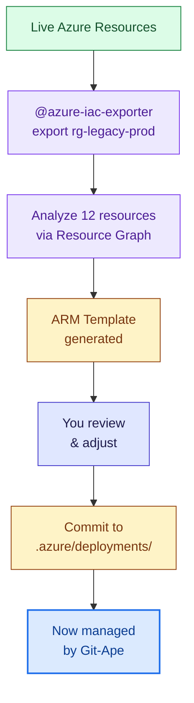

# Import Existing Infrastructure

> **TL;DR** — Use `@azure-iac-exporter` to reverse-engineer live Azure resources into ARM templates. Bring existing infrastructure under Git-Ape management.

## Workflow



## Invoke It

```
@azure-iac-exporter export rg-legacy-app-prod
```

## What Happens

1. **Resource discovery** — queries Azure Resource Graph for all resources in the resource group
2. **Template generation** — creates an ARM template with parameters for each resource
3. **State capture** — generates `state.json` with current deployment state
4. **Security assessment** — runs the security analyzer on the exported template
5. **Gap identification** — flags resources missing best practices (e.g., no managed identity)

## Output Structure

```
.azure/deployments/legacy-app-prod/
├── template.json         # Generated ARM template
├── parameters.json       # Extracted parameter values
├── metadata.json         # Deployment metadata
├── state.json           # Current state snapshot
└── architecture.md      # Auto-generated diagram
```

## Common Scenarios

| Scenario | Command |
|----------|---------|
| Import a resource group | `@azure-iac-exporter export rg-myapp-prod` |
| Import specific resources | `@azure-iac-exporter export rg-myapp-prod --filter "Microsoft.Web/*"` |
| Generate only Bicep | `@azure-iac-generator` (after export) |

## After Import

Once imported, the resources are managed like any other Git-Ape deployment:

- **Drift detection** catches future manual changes
- **Security analysis** identifies gaps to remediate
- **CI/CD workflows** handle future updates via PR → Plan → Deploy

## Related

- [Agents: Azure IaC Exporter](/docs/agents/azure-iac-exporter)
- [Drift Detection](/docs/use-cases/drift-detection)
- [CI/CD Pipeline](/docs/use-cases/cicd-pipeline)
