# Multi-Environment Strategy

> **TL;DR** — Use one ARM template with environment-specific parameter files. Promote from dev → staging → prod with the same security and compliance guarantees.

## Environment Layout

```mermaid
graph LR
    subgraph DEV["Dev (eastus)"]
        D_RG["rg-app-dev-eastus"]
        D_FUNC["func-app-dev-eastus<br/>Consumption"]
    end

    subgraph STAGING["Staging (eastus)"]
        S_RG["rg-app-staging-eastus"]
        S_FUNC["func-app-staging-eastus<br/>Premium EP1"]
    end

    subgraph PROD["Prod (eastus + westus2)"]
        P_RG1["rg-app-prod-eastus"]
        P_FUNC1["func-app-prod-eastus<br/>Premium EP2"]
        P_RG2["rg-app-prod-westus2"]
        P_FUNC2["func-app-prod-westus2<br/>Premium EP2"]
    end

    DEV --> |"Promote"| STAGING
    STAGING --> |"Promote"| PROD

    classDef dev fill:#dbeafe,stroke:#1f6feb,stroke-width:1px,color:#0b3d91
    classDef stg fill:#fde68a,stroke:#b45309,stroke-width:1px,color:#7c2d12
    classDef prod fill:#fecaca,stroke:#b91c1c,stroke-width:2px,color:#7f1d1d
    class D_RG,D_FUNC dev
    class S_RG,S_FUNC stg
    class P_RG1,P_FUNC1,P_RG2,P_FUNC2 prod
```



## File Structure

```
.azure/deployments/order-api/
├── template.json              # Shared template
├── parameters.dev.json        # Dev overrides
├── parameters.staging.json    # Staging overrides
├── parameters.prod.json       # Prod overrides
└── metadata.json
```

## Parameter Differences

| Parameter | Dev | Staging | Prod |
|-----------|-----|---------|------|
| `environment` | dev | staging | prod |
| `skuName` | Y1 (Consumption) | EP1 (Premium) | EP2 (Premium) |
| `minInstances` | 0 | 1 | 3 |
| `maxInstances` | 10 | 20 | 50 |
| `geoRedundancy` | false | false | true |

## Promotion Workflow

1. **Dev** — deploy freely, test features
2. **Staging** — mirrors prod SKUs, integration tests
3. **Prod** — requires PR approval + environment protection rules

GitHub environment protection rules enforce the gate:

| Environment | Required Reviewers | Branch Restriction |
|------------|-------------------|-------------------|
| `azure-dev` | None | Any branch |
| `azure-staging` | 1 reviewer | `main` only |
| `azure-prod` | 2 reviewers | `main` only |

## Related

- [CI/CD Pipeline](/docs/use-cases/cicd-pipeline)
- [For DevOps](/docs/personas/for-devops)
- [For Platform Engineering](/docs/personas/for-platform-engineering)
