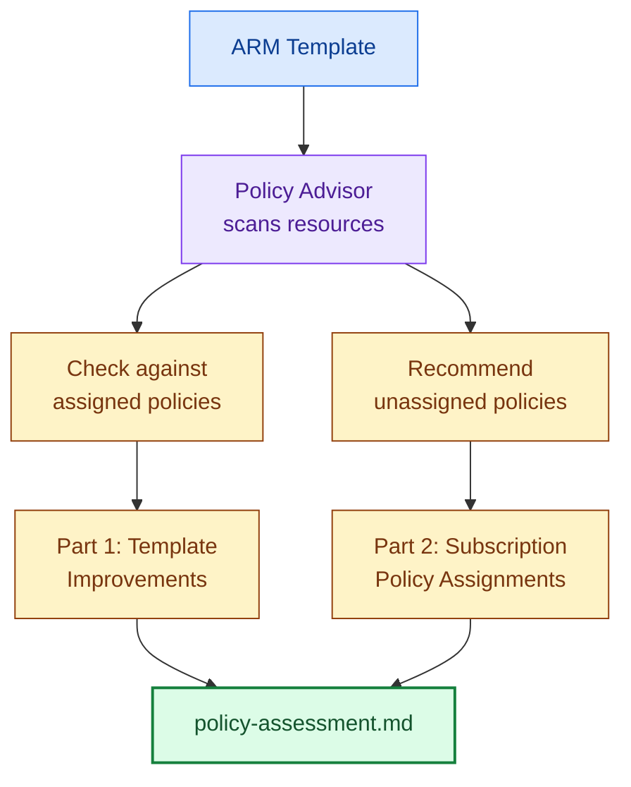

# Policy Compliance

> **TL;DR** — The `@azure-policy-advisor` agent checks your ARM template against subscription policies and recommends additional policies. Advisory only — it surfaces findings without blocking.

## How It Works



## Invoke It

```
@azure-policy-advisor assess my template
```

## Report Structure

### Part 1: Template Improvements

Issues found in the ARM template that conflict with assigned policies:

| Resource | Policy | Effect | Status |
|----------|--------|--------|--------|
| Storage Account | Require HTTPS | Deny | ✅ Compliant |
| Function App | Require managed identity | Audit | ⚠️ Not configured |
| SQL Server | Require AAD-only auth | Deny | ✅ Compliant |

### Part 2: Recommended Policy Assignments

Policies from Microsoft Learn best practices that are not yet assigned to your subscription:

| Category | Policy | Effect | Recommendation |
|----------|--------|--------|---------------|
| Storage | Require TLS 1.2 | Deny | Assign to prevent legacy TLS |
| Compute | Require HTTPS-only | Deny | Assign to enforce encryption |
| Monitoring | Require diagnostic settings | AuditIfNotExists | Assign for visibility |

## Compliance Frameworks

Git-Ape supports assessment against:

- **CIS Azure Foundations v3.0**
- **NIST SP 800-53 Rev 5**
- **General Azure best practices** (default)

## Related

- [Skills: Azure Policy Advisor](/docs/skills/azure-policy-advisor)
- [Agents: Azure Policy Advisor](/docs/agents/azure-policy-advisor)
- [Security Analysis](/docs/use-cases/security-analysis)
- [For Platform Engineering](/docs/personas/for-platform-engineering)
