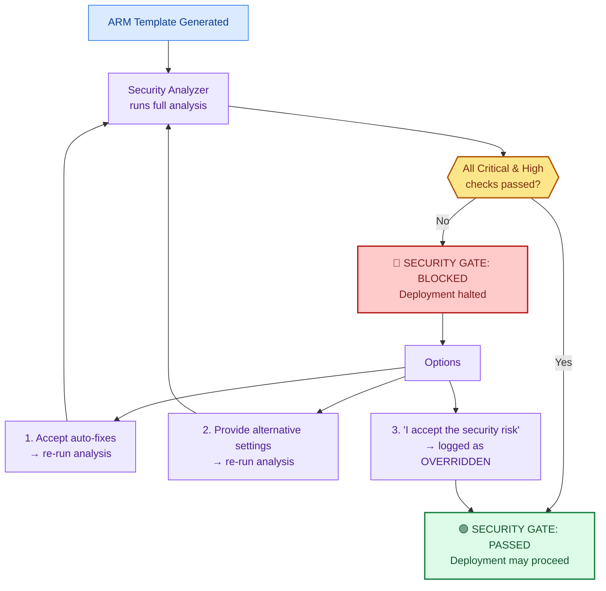

# Security Analysis

> **TL;DR** — Every deployment goes through a blocking security gate. All Critical and High severity checks must pass. No shortcuts — the gate loops until PASSED or explicitly overridden.

## Security Gate Decision Tree



## What Gets Checked

| Category | Checks | Severity |
|----------|--------|----------|
| Identity | Managed identity enabled, no connection strings | Critical |
| Encryption | HTTPS-only, TLS 1.2+, encryption at rest | Critical |
| Access Control | RBAC assignments, least privilege, no shared keys | High |
| Network | FTP disabled, firewall rules, IP restrictions | High |
| Authentication | AAD-only for SQL, Key Vault RBAC mode | High |
| Secrets | Key Vault references, no plaintext secrets | Critical |
| Monitoring | Diagnostic settings, App Insights connected | Medium |
| Configuration | Resource tags, naming compliance | Low |

## Example Security Report

```
🔒 Security Analysis — func-orderapi-dev-eastus

  Critical (2/2 passed):
    ✅ Managed identity enabled (system-assigned)
    ✅ No connection strings or shared keys

  High (4/4 passed):
    ✅ HTTPS-only enforced
    ✅ TLS 1.2 minimum
    ✅ FTP disabled (ftpsState: Disabled)
    ✅ RBAC: Storage Blob Data Contributor assigned

  Medium (2/2 passed):
    ✅ Application Insights connected
    ✅ Diagnostic logging enabled

  Low (1/1 passed):
    ✅ Resource tags applied (Environment, Project, ManagedBy)

🟢 SECURITY GATE: PASSED
```

## Recovery Rules

When a deployment fails after passing the security gate, Git-Ape follows strict recovery rules:

:::danger[Never Weaken Security]
- Do NOT re-enable shared key access
- Do NOT disable firewalls or open NSGs
- Do NOT remove authentication requirements
- Do NOT replace identity-based access with connection strings

Instead: verify RBAC roles, check policy conflicts, fix resource dependencies.
:::

## Related

- [Skills: Azure Security Analyzer](/docs/skills/azure-security-analyzer)
- [Skills: Azure Role Selector](/docs/skills/azure-role-selector)
- [For Executives](/docs/personas/for-executives)
- [For Platform Engineering](/docs/personas/for-platform-engineering)
