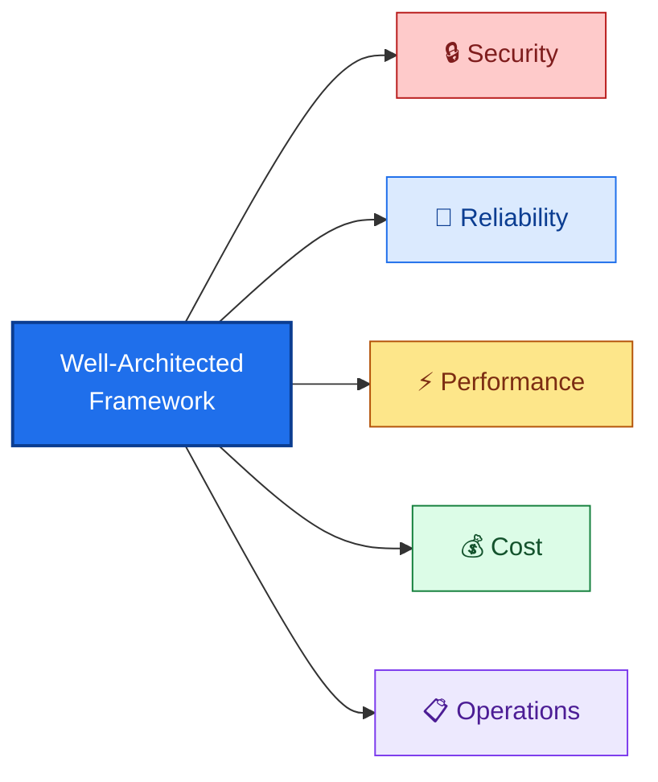

# WAF Architecture Review

> **TL;DR** — The `@azure-principal-architect` agent reviews your deployment against the Azure Well-Architected Framework's 5 pillars and provides actionable recommendations.

## The 5 Pillars



| Pillar | What It Assesses |
|--------|-----------------|
| **Security** | Identity, encryption, network isolation, secret management |
| **Reliability** | Redundancy, failover, backup, SLA targets |
| **Performance** | Scaling, latency, throughput, SKU sizing |
| **Cost Optimization** | Right-sizing, reserved instances, unused resources |
| **Operational Excellence** | Monitoring, alerting, deployment practices, IaC |

## How to Use It

```
@azure-principal-architect review my order-api deployment
```

The architect agent:

1. Reads the ARM template and deployment state
2. Evaluates each resource against all 5 pillars
3. Produces a scored assessment with recommendations
4. Highlights trade-offs between pillars (e.g., cost vs. reliability)

## Example Findings

```
📋 WAF Assessment — rg-orderapi-dev-eastus

  🔒 Security: 9/10
     ✅ Managed identity, RBAC, TLS 1.2
     ⚠️  Consider adding IP restrictions for Function App

  🔄 Reliability: 6/10
     ⚠️  Consumption plan has cold starts — consider Premium (EP1) for prod
     ⚠️  No geo-redundancy configured

  ⚡ Performance: 8/10
     ✅ Consumption plan auto-scales
     ⚠️  Storage LRS — consider ZRS for higher availability

  💰 Cost: 9/10
     ✅ Consumption plan minimizes idle cost
     ✅ Standard LRS is cheapest storage tier

  📋 Operations: 7/10
     ✅ App Insights + Log Analytics configured
     ⚠️  No alerting rules defined
     ⚠️  No deployment slots for zero-downtime updates
```

## When to Use

- **Before production promotion** — review a dev deployment before cloning to prod
- **Architecture decisions** — compare Consumption vs. Premium Function App plans
- **Compliance reviews** — demonstrate WAF alignment to auditors
- **Post-incident** — evaluate reliability gaps after an outage

## Related

- [Agents: Azure Principal Architect](/docs/agents/azure-principal-architect)
- [Security Analysis](/docs/use-cases/security-analysis)
- [For Engineering Leads](/docs/personas/for-engineering-leads)
