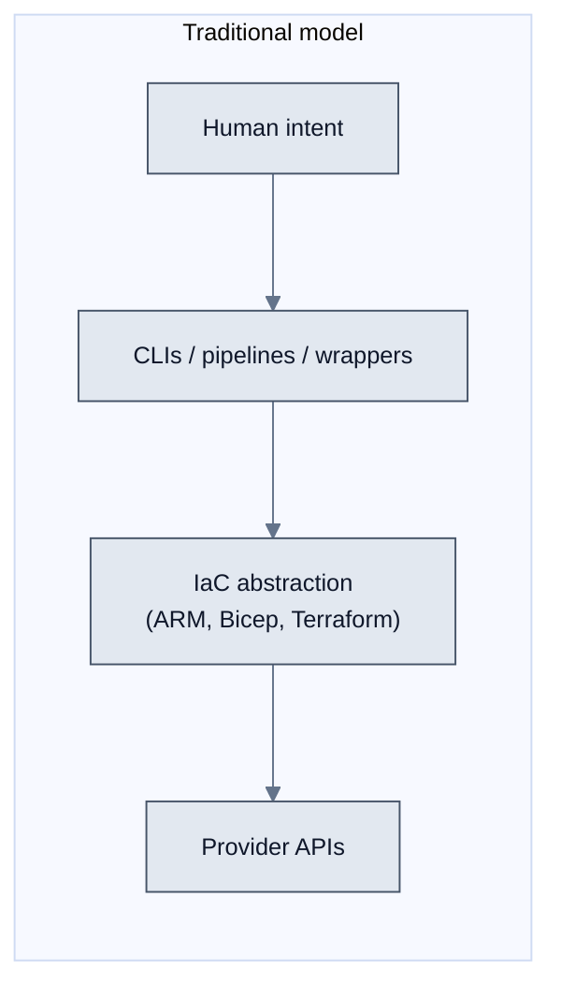
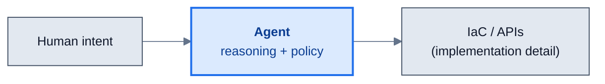
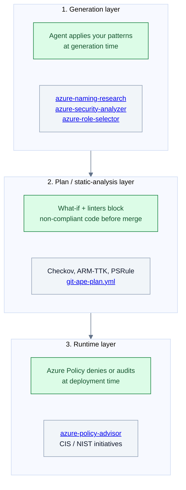

# Vision & Manifesto

Git-Ape is the implementation of a thesis Microsoft published in March 2026: **[Platform Engineering for the Agentic AI Era](https://devblogs.microsoft.com/all-things-azure/platform-engineering-for-the-agentic-ai-era/)**. This page summarizes the thesis and shows where each idea is implemented in the codebase.

## The shift

For a decade, platform engineering relied on humans translating intent into machine-safe API calls — through CLIs, SDKs, pipelines, wrappers, and UI workflows.

AI agents collapse that stack. They ingest natural language, reason over API schemas, generate and validate IaC, and apply changes through provider APIs — all while enforcing guardrails and approvals inline.

> **Agents don't bypass APIs — they bypass humans as API translators.** The interaction layer becomes implicit, dynamically constructed by the agent using API specs, provider schemas, and organizational controls.

## What Git-Ape is

Git-Ape is an **agent + policy** platform-engineering framework for Azure, built on GitHub Copilot. It is an alternative to module-first IaC platforms, designed to deploy any Azure workload from natural-language intent.

| Module-first platform | Git-Ape (agents + policy) |
|---|---|
| 50+ Terraform/Bicep modules to maintain | One agent, many compiled outputs |
| Last year's API surface | Reads live Azure REST API specs ([azure-rest-api-reference](/docs/skills/azure-rest-api-reference)) |
| Static `README.md` per module | Living docs generated at conversation time |
| "Update 50 modules when standards change" | "Update the agent's context" |
| Compliance enforced at PR review | Compliance enforced at generation, plan, and runtime |

## How it works — three layers of enforcement

The manifesto's central claim is that compliance is no longer a gate you pass through — it is **inherent in the process**. Git-Ape implements that with three enforcement layers:

### Generation layer

Git-Ape skills enforce policy **before** any IaC is written:

- **[`azure-naming-research`](/docs/skills/azure-naming-research)** — looks up CAF abbreviations and validates names against Azure constraints
- **[`azure-rest-api-reference`](/docs/skills/azure-rest-api-reference)** — reads the live Azure REST API specs so generated templates use correct properties and the latest stable API versions
- **[`azure-security-analyzer`](/docs/skills/azure-security-analyzer)** — blocks Critical and High security findings before deployment
- **[`azure-role-selector`](/docs/skills/azure-role-selector)** — recommends least-privilege roles instead of broad Contributor grants

### Plan / static-analysis layer

When a PR is opened, **[`git-ape-plan.yml`](/docs/workflows/git-ape-plan)** runs Checkov, ARM-TTK, PSRule, Template Analyzer, plus `az deployment what-if`. Non-compliant code is blocked before merge. See [Security Analysis](/docs/use-cases/security-analysis).

### Runtime layer

Even after merge, **[`azure-policy-advisor`](/docs/skills/azure-policy-advisor)** assesses your templates against Azure Policy initiatives (CIS Azure Foundations v3.0, NIST SP 800-53 Rev 5) and Azure Policy denies or audits non-compliant deployments at the control plane.

## What does not change

The fundamentals remain:

- **Provider APIs** are still the ultimate source of truth.
- **Human accountability** remains essential. Git-Ape never deploys without explicit user confirmation, and CI/CD deploys require PR approval.
- **IaC** is still the deterministic, versioned, reviewable execution format. It is not eliminated — it becomes a **compiled artifact** generated from higher-order inputs.

What changes is your **system of record**. Architecture artifacts (ADRs, reference patterns, security baselines, naming conventions) become the governing ledger. The agent's execution trace — saved in [`.azure/deployments/`](/docs/deployment/state) — is the binding evidence between intent and outcome.

## The new artifacts the platform team produces

Quoting the manifesto:

> The module registry isn't dead — but it's no longer the centre of gravity. **The new artifact is the agent.** Policies, context documents, and examples become inputs the agent consumes. The agent itself is what the platform team produces — versioned, tested, and deployed like any other software.

In Git-Ape this maps to:

| Concept | Where it lives in the repo |
|---|---|
| Repo-level instructions | `.github/copilot-instructions.md` |
| Reusable skills | [`.github/skills/`](/docs/skills/overview) |
| Custom agents | [`.github/agents/`](/docs/agents/overview) |
| CI/CD enforcement | [`.github/workflows/`](/docs/workflows/overview) |
| Execution trace | [`.azure/deployments/`](/docs/deployment/state) |

## Who this changes things for

The manifesto identifies four shifts that map directly to the audiences Git-Ape serves:

| Shift | Audience | Where to read more |
|---|---|---|
| Interaction shifts from syntax to intent | **[Engineers](/docs/personas/for-engineers)** describe what they need in natural language | [Deploy anything](/docs/use-cases/deploy-anything) |
| Guardrails move into the agent | **[Platform engineers](/docs/personas/for-platform-engineering)** ship agents and skills, not module catalogues | [Skills overview](/docs/skills/overview) |
| Compliance is inherent in the process | **[Executives](/docs/personas/for-executives)** get continuous compliance evidence, not point-in-time audits | [Security Analysis](/docs/use-cases/security-analysis) |
| Drift remediation becomes continuous | **[DevOps & SRE](/docs/personas/for-devops)** detect drift, propose fixes, request approval, apply remediations | [Drift Detection](/docs/deployment/drift-detection) |

## What's next

This implementation covers Azure ARM today, with an explicit roadmap toward Bicep and Terraform compatibility, code-to-cloud security with Defender for Cloud, and day-2 operations through Azure SRE Agent.

Read the original article: **[Platform Engineering for the Agentic AI Era](https://devblogs.microsoft.com/all-things-azure/platform-engineering-for-the-agentic-ai-era/)** by Arnaud Lheureux and David Wright.

Then jump into the project:

- [Installation](/docs/getting-started/installation) — get Git-Ape running in 5 minutes
- [Onboarding](/docs/getting-started/onboarding) — wire up OIDC and CI/CD
- [Agents](/docs/agents/overview) and [Skills](/docs/skills/overview) — see what's already implemented
