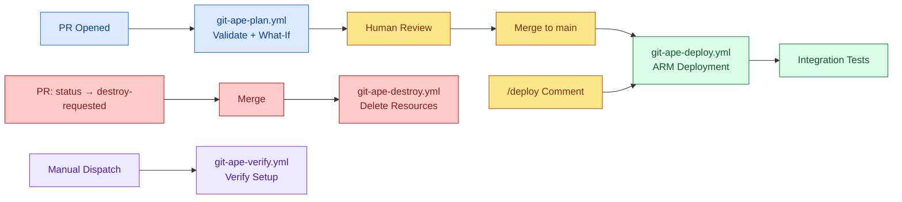

<!-- AUTO-GENERATED — DO NOT EDIT. Source: .github/workflows/ -->

# CI/CD Workflows Overview

Git-Ape provides GitHub Actions workflows for automated deployment lifecycle management.

:::info[Activation required]
Workflows ship as **`*.exampleyml`** files in `.github/workflows/` so they are inert when the plugin is first installed. The [`/git-ape-onboarding`](/docs/skills/git-ape-onboarding) flow renames each `.exampleyml` to `.yml` after you complete the experimental-status acknowledgments. Files still ending in `.exampleyml` in the inventory below are not yet active.
:::

## Workflow Inventory

| Workflow | File | Triggers | Jobs |
|----------|------|----------|------|
| [Daily Repo Status](./daily-repo-status-lock) | `daily-repo-status.lock.yml` | schedule, workflow_dispatch | activation, agent, conclusion, detection, safe_outputs |
| [Git-Ape: Workflow Lint](./git-ape-actionlint) | `git-ape-actionlint.yml` | pull_request | actionlint |
| [Git-Ape: Extension Build](./git-ape-build) | `git-ape-build.yml` | pull_request | build |
| [Git-Ape: Deploy](./git-ape-deploy) | `git-ape-deploy.exampleyml` | push, issue_comment | check-comment-trigger, detect-deployments, deploy |
| [Git-Ape: Destroy](./git-ape-destroy) | `git-ape-destroy.exampleyml` | push, workflow_dispatch | detect-destroys, destroy |
| [Git-Ape: Docs Check](./git-ape-docs-check) | `git-ape-docs-check.yml` | pull_request | check-docs |
| [Git-Ape: Docs Deploy](./git-ape-docs) | `git-ape-docs.yml` | push | build, deploy |
| [Git-Ape: Plan](./git-ape-plan) | `git-ape-plan.exampleyml` | pull_request | detect-deployments, plan-local, plan-azure, plan-comment |
| [Git-Ape: Plugin Version Check](./git-ape-plugin-version-check) | `git-ape-plugin-version-check.yml` | pull_request | check-version-drift |
| [Git-Ape: Plugin Release](./git-ape-release) | `git-ape-release.yml` | push, workflow_dispatch | release |
| [Git-Ape: Verify Setup](./git-ape-verify) | `git-ape-verify.exampleyml` | workflow_dispatch | verify |
| [Issue Triage Agent](./issue-triage-agent-lock) | `issue-triage-agent.lock.yml` | schedule, workflow_dispatch | activation, agent, conclusion, detection, safe_outputs |
| [PR Validation](./pr-validation) | `pr-validation.yml` | pull_request | structure-check, markdownlint |

## Pipeline Architecture

