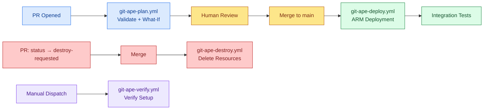

<!-- AUTO-GENERATED — DO NOT EDIT. Source: .github/workflows/ -->

# CI/CD Workflows Overview

Git-Ape provides GitHub Actions workflows for automated deployment lifecycle management.

:::info[Workflows ship via the onboarding skill]
The user-facing workflows below are **shipped as templates** under `.github/skills/git-ape-onboarding/templates/workflows/` and **scaffolded into your repository** by the [`/git-ape-onboarding`](/docs/skills/git-ape-onboarding) flow. The scaffold step uses **skip-with-notice on collision** — it never overwrites an existing file. The workflows ship as ready-to-run `.yml` files (no manual rename needed) and do not run inside the git-ape repo itself.
:::

## User-facing workflows (scaffolded into your repo)

| Workflow | Template file | Triggers | Jobs |
|----------|---------------|----------|------|
| [Git-Ape: Deploy](./git-ape-deploy) | `.github/skills/git-ape-onboarding/templates/workflows/git-ape-deploy.yml` | push | detect-deployments, deploy |
| [Git-Ape: Destroy](./git-ape-destroy) | `.github/skills/git-ape-onboarding/templates/workflows/git-ape-destroy.yml` | push, workflow_dispatch | detect-destroys, destroy |
| [Continuous Drift Remediation](./git-ape-drift-lock) | `.github/skills/git-ape-onboarding/templates/workflows/git-ape-drift.lock.yml` | schedule, workflow_dispatch | activation, agent, conclusion, detection, safe_outputs, update_cache_memory |
| [Git-Ape: Plan](./git-ape-plan) | `.github/skills/git-ape-onboarding/templates/workflows/git-ape-plan.yml` | pull_request | detect-deployments, plan-local, plan-azure, plan-comment |
| [Git-Ape: Verify Setup](./git-ape-verify) | `.github/skills/git-ape-onboarding/templates/workflows/git-ape-verify.yml` | workflow_dispatch | verify |

## Repo CI workflows (run inside the git-ape repo)

| Workflow | File | Triggers | Jobs |
|----------|------|----------|------|
| [Daily Repo Status](./daily-repo-status-lock) | `.github/workflows/daily-repo-status.lock.yml` | schedule, workflow_dispatch | activation, agent, conclusion, detection, safe_outputs |
| [Git-Ape: Workflow Lint](./git-ape-actionlint) | `.github/workflows/git-ape-actionlint.yml` | pull_request | actionlint |
| [Git-Ape: Extension Build](./git-ape-build) | `.github/workflows/git-ape-build.yml` | pull_request | build |
| [Git-Ape: Docs Check](./git-ape-docs-check) | `.github/workflows/git-ape-docs-check.yml` | pull_request | check-docs |
| [Git-Ape: Docs Deploy](./git-ape-docs) | `.github/workflows/git-ape-docs.yml` | push | build, deploy |
| [Git-Ape: Onboarding Template Check](./git-ape-onboarding-template-check) | `.github/workflows/git-ape-onboarding-template-check.yml` | pull_request, workflow_dispatch | check-sync-bash, check-sync-pwsh, scaffold-parity-smoke, scaffold-enterprise-parity-smoke |
| [Git-Ape: Plugin Version Check](./git-ape-plugin-version-check) | `.github/workflows/git-ape-plugin-version-check.yml` | pull_request | check-version-drift |
| [Git-Ape: Plugin Release](./git-ape-release) | `.github/workflows/git-ape-release.yml` | push, workflow_dispatch | release |
| [Issue Triage Agent](./issue-triage-agent-lock) | `.github/workflows/issue-triage-agent.lock.yml` | schedule, workflow_dispatch | activation, agent, conclusion, detection, safe_outputs |
| [PR Validation](./pr-validation) | `.github/workflows/pr-validation.yml` | pull_request | structure-check, markdownlint |
| [Waza agent evals](./waza-agent-evals) | `.github/workflows/waza-agent-evals.yml` | pull_request, workflow_dispatch | preflight, prepare, tokens, eval, comment |
| [Waza skill evals](./waza-evals) | `.github/workflows/waza-evals.yml` | pull_request, workflow_dispatch | preflight, prepare, tokens, eval, comment |

## Pipeline Architecture

