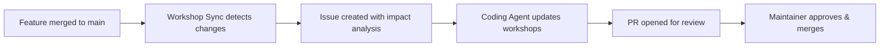

# Workshops

Guided hands-on learning tracks for deploying Azure infrastructure with Git-Ape. Choose the track that matches your role and experience level.

## Choose Your Track

| Track | Audience | Duration | Azure Required? | What You Learn |
|-------|----------|----------|-----------------|----------------|
| [Zero to Deploy](./track-1-zero-to-deploy) | Beginners, non-technical | 30 min | No | Deploy Azure infra with a single sentence |
| [Deploy Like a Pro](./track-2-deploy-like-a-pro) | Engineers, developers | 60 min | Yes (sandbox) | Security gates, cost estimation, architecture review |
| [Platform Engineering](./track-3-platform-engineering) | DevOps, SRE, platform eng | 90 min | Yes (sandbox) | CI/CD pipelines, headless mode, policy compliance |
| [Executive Briefing](./track-4-executive-briefing) | Engineering leads, execs | 20 min | No | Governance, cost visibility, ROI |

## Content Philosophy

- **80% hands-on, 20% slides.** You learn by doing.
- **Codespaces-first.** Every track works in a browser with no local install.
- **Modular.** Complete one track or all four. Each stands alone.

## Auto-Updating Content

Workshop content stays in sync with Git-Ape features automatically. When agents, skills, or workflows change on `main`, the [Workshop Sync workflow](https://github.com/Azure/git-ape/blob/main/.github/workflows/git-ape-workshop-sync.yml) detects the changes and creates an issue for the Copilot Coding Agent to update the affected labs.

### When Workshop Content DOES Auto-Update

| Change merged to `main` | Impacted Tracks |
|--------------------------|----------------|
| Agent added or modified (`.github/agents/`) | Track 1 (Zero to Deploy), Track 2 (Deploy Like a Pro) |
| Skill added or modified (`.github/skills/`) | Track 2 (Deploy Like a Pro), Track 4 (Executive Briefing) |
| Core workflow modified (`git-ape-plan.yml`, `git-ape-deploy.yml`, `git-ape-destroy.yml`, `git-ape-verify.yml`) | Track 3 (Platform Engineering) |
| Multiple change types at once | All impacted tracks combined in a single issue |

When a qualifying change merges, the workflow:

1. Identifies which files changed and categorizes them (agent, skill, or workflow).
2. Maps changes to the workshop tracks that reference those features.
3. Creates a GitHub Issue with label `workshop-sync` containing the change summary, impacted tracks, and instructions for the Copilot Coding Agent.
4. The Coding Agent reads the changed source files and existing workshop content, generates targeted updates, and opens a PR.
5. One maintainer approves the PR before merge.

If an open `workshop-sync` issue already exists (from a recent change), new changes are appended as a comment instead of creating a duplicate issue.

### When Workshop Content Does NOT Auto-Update

| Change merged to `main` | Why no trigger |
|--------------------------|---------------|
| Workshop files edited (`workshops/`) | Workshops are the *output*, not input — editing them directly is intentional |
| Docs site files (`website/`) | Docs infrastructure changes don't indicate a feature change |
| README, copilot-instructions, plugin.json | Not agent/skill/workflow changes |
| `git-ape-workshop-sync.yml` itself | Excluded to avoid infinite loops |
| `git-ape-docs.yml` or `git-ape-docs-check.yml` | Docs pipeline changes, not feature changes |

### Docs Site Rebuild Triggers

Workshop content changes **do** trigger a docs site rebuild. When any file under `workshops/` is modified and merged to `main`, the `git-ape-docs.yml` workflow rebuilds and redeploys the GitHub Pages site.

## Full Workshop Content

The complete lab guides, deck outlines, and facilitator resources live in the [`workshops/`](https://github.com/Azure/git-ape/tree/main/workshops) directory of the repository.

## For Facilitators

See the [Facilitator Guide](https://github.com/Azure/git-ape/blob/main/workshops/FACILITATOR-GUIDE.md) for timing breakdowns, setup checklists, talking points, and delivery mode adaptation.
