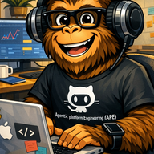

<!-- _class: lead -->
<!-- Speaker notes (Slide 1 — Hero). Welcome the room and frame the session: this is a 30-minute hands-on intro for enterprise teams. By the end of the session every attendee will have deployed real Azure infrastructure using one English sentence. No prior ARM, Bicep, or Terraform knowledge is required. Before starting, confirm everyone has GitHub Codespaces, Dev Containers, or VS Code open, and that Copilot is signed in. -->

<div class="hero-grid">
<div>
<div class="eyebrow">Git-Ape - Track 1 - Zero to Deploy</div>

# Deploy Azure Infrastructure

## With a Single Sentence

### A 30-minute hands-on intro for enterprise teams

<div class="badge-row"><div class="badge">No cloud expertise needed</div><div class="badge">Runs in your browser</div><div class="badge">Hands-on lab</div></div>
</div>
<div class="hero-card center">



### AI-powered cloud deployment

<div class="pill">6 slides</div><div class="pill">30 minutes</div><div class="pill">Beginner friendly</div>
</div>
</div>

---

<!-- _class: gradient -->
<!-- Speaker notes (Slide 2 — What Is Git-Ape?). Lead with the value: Git-Ape turns plain English into production-ready Azure infrastructure. It is built on GitHub Copilot, so it lives inside the tools engineers already use — VS Code or the browser. On every deployment three things happen automatically: a security review, a real-pricing cost estimate, and an architecture diagram. Emphasise that no cloud expertise is required by the requester — this is designed for application developers, not infrastructure specialists. Pause for any quick questions before moving on. -->

# What Is Git-Ape?

## Deploy Azure infrastructure with a sentence

<div class="columns">
<div>

### The idea

- An **AI assistant** that turns plain English into production-ready Azure infrastructure
- Built on **GitHub Copilot** - works in VS Code or the browser
- Handles **security, cost estimation, and architecture** automatically
- **No cloud expertise required** for the requester

</div>
<div class="panel">

### From sentence to deployment

<div class="flow-tight">
<div class="flow-box"><h3>Say</h3></div>
<div class="arrow">&rarr;</div>
<div class="flow-box"><h3>Plan</h3></div>
<div class="arrow">&rarr;</div>
<div class="flow-box"><h3>Gate</h3></div>
<div class="arrow">&rarr;</div>
<div class="flow-box"><h3>Ship</h3></div>
</div>

<p class="note center">Cost estimate and architecture diagram come for free.</p>

</div>
</div>

---

<!-- _class: light -->
<!-- Speaker notes (Slide 3 — How It Works). This is the most important slide for the early wow moment. Git-Ape is a conversation, not a wizard. Walk through the four steps in order. Stress that step two, the clarifying questions, is the secret to producing correct templates without forcing the requester to know Azure. The sample conversation on the right shows exactly what attendees will type in Lab 2. Remind attendees that three artifacts always come back regardless of whether they deploy: security report, cost estimate, and architecture diagram. Deployment itself is opt-in — they can stop at the artifacts. -->

# How It Works

## A conversation, not a configuration file

<div class="columns">
<div>

### Four steps, in plain English

1. **You describe** what you need
2. **Git-Ape asks** clarifying questions - region, environment, project name
3. **Git-Ape generates** the template, security report, and cost estimate
4. **You confirm** - it deploys, or you keep the artifacts without deploying

</div>
<div class="panel">

### Sample conversation

```text
@git-ape deploy a Python function
app for the inventory project in dev
```

<p class="mini">&rarr; Region? <strong>eastus</strong></p>
<p class="mini">&rarr; Storage SKU? <strong>Standard_LRS</strong></p>
<p class="mini">&rarr; Enable monitoring? <strong>Yes</strong></p>

<div class="badge-row"><div class="badge">Security pass</div><div class="badge">Cost ~$0.40/mo</div><div class="badge">Diagram</div></div>

<p class="note">Use your own words. No forms. No wizards.</p>

</div>
</div>

---

<!-- _class: gradient -->
<!-- Speaker notes (Slide 4 — What You'll Build Today). Today's lab deploys a Python Function App with a Storage Account and Application Insights. Highlight that every connection uses managed identity — zero secrets in code, zero connection strings, zero shared keys. Estimated cost is well under one dollar a month for light use; Storage at LRS is the largest line item. The architecture diagram on the right is generated automatically by Git-Ape — attendees will see this exact pattern emerge from their own prompt in Lab 2. -->

# What You'll Build Today

## A Python Function App on Azure

<div class="columns">
<div>

### Resources

- **Function App** - serverless, runs your code on demand
- **Storage Account** - backing storage (blob + queue)
- **Application Insights** - built-in monitoring & logs
- **Managed identity** - no passwords stored anywhere

<div class="badge-row"><div class="badge">Serverless</div><div class="badge">~$1/month light use</div><div class="badge">Identity-based auth</div></div>

</div>
<div class="panel">

### Architecture


</div>
</div>

---

<!-- _class: gradient -->
<!-- Speaker notes (Slide 5 — Let's Go). Three environment options. All produce the same outcome. Codespaces is fastest for first-time attendees — no install, runs entirely in the browser. Dev Containers is the best fit for engineers who already use VS Code with Docker and want a fully local environment. VS Code Local works for experienced users who already have the prerequisites installed. Give the room two to three minutes to launch their environment and help any stragglers. Then point them to Lab 1: Setup in the lab guide. -->

# Let's Go!

## Set up your environment in 2 minutes

<div class="option-row">
<div class="option">
<span class="opt-name">GitHub Codespaces</span>
<p>Browser only<br/>~30s if cached<br/>Zero install</p>
<div class="opt-meta">Recommended for first-time users</div>
</div>
<div class="option">
<span class="opt-name">Dev Containers</span>
<p>VS Code + Docker<br/>Tools pre-installed<br/>Local environment</p>
<div class="opt-meta">Best for offline use</div>
</div>
<div class="option">
<span class="opt-name">VS Code Local</span>
<p>Your machine<br/>Install tools manually<br/>Full control</p>
<div class="opt-meta">For experienced users</div>
</div>
</div>

<p class="note center">Container-based options ship with Azure CLI, Bicep, GitHub CLI, Node, Python, .NET, and every Git-Ape skill pre-installed. Open the lab guide and start with <strong>Lab 1: Setup</strong>.</p>

---

<!-- _class: light -->
<!-- Speaker notes (Slide 6 — Recap & Next Steps). Quick recap: in thirty minutes attendees deployed Azure infrastructure with one sentence, got an automatic security review with a blocking gate, saw a real-pricing cost estimate, and generated an architecture diagram. No ARM templates were written by hand. No portal clicks. This is the value proposition in concrete form. Point engineers and developers to Track 2 for multi-resource architectures and a security deep dive. Point DevOps and platform engineers to Track 3 for CI/CD, headless mode, and policy compliance. Finally, share the GitHub repository for documentation and community. Open the floor to questions or a volunteer demo if time permits. -->

# Recap & Next Steps

## What you just did

<div class="columns">
<div class="panel">

### In 30 minutes you

- Deployed Azure infrastructure with **one sentence**
- Got an automatic **security review** with a blocking gate
- Saw a **cost estimate** from real Azure pricing
- Generated an **architecture diagram**

<div class="badge-row"><div class="badge">No ARM templates written</div><div class="badge">No portal clicks</div></div>

</div>
<div>

### Where to go next

<div class="next-card">
<h3>Track 2 - Deploy Like a Pro</h3>
<p>Multi-resource architectures, security deep dive (60 min)</p>
</div>

<div class="next-card">
<h3>Track 3 - Platform Engineering</h3>
<p>CI/CD, headless mode, policy compliance (90 min)</p>
</div>

<div class="next-card">
<h3>Documentation</h3>
<p>github.com/Azure/git-ape</p>
</div>

</div>
</div>
